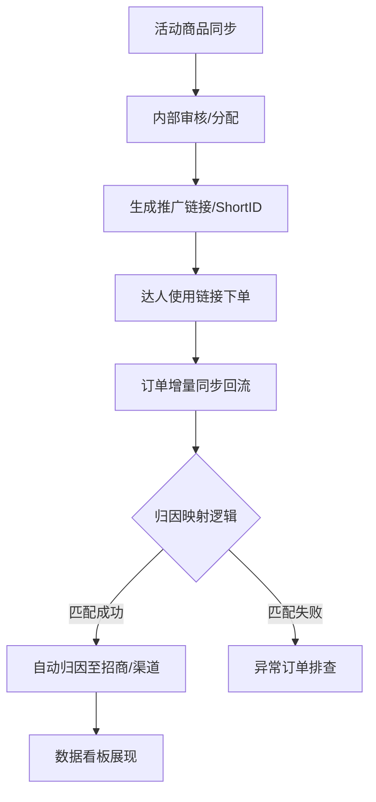

# 01-业务闭环

更新时间：2026-04-21

## 一、核心业务闭环图 (SOP)

本项目的核心逻辑是实现 **“商品-转链-订单-业绩”** 的全生命周期闭环。

## 二、关键业务流程详解

### 1. 商品引入与准备 (招商中心)
- **同步**：从抖店后台拉取最新的活动商品快照。
- **初筛**：由业务主管判断商品是否符合本团队推广标准。
- **分配**：将商品分配给具体的“招商负责人”。

### 2. 推广通路建设 (转链中心)
- **转链**：系统为每位招商负责人/达人生成带有唯一 `pick_source` 的推广链接。
- **记录**：生成的映射关系保存在 `pick_source_mapping` 表中。

### 3. 订单回流与识别 (归因引擎)
- **获取**：通过 SDK 获取结算订单详情。
- **提取**：解析订单中的 `pick_source` 参数。
- **匹配**：在映射表中查找该参数对应的业务主体。

### 4. 寄样闭环 (物流协同)
- **申请**：达人基于选品页发起寄样申请。
- **流转**：申请单经过“待审核 -> 待发货 -> 快递中 -> 待交作业 -> 已完成”的标准化流程。
- **自动触发**：当对应的推广链接产生第一笔订单时，寄样单可选择自动标记为“已完成”。

## 三、用户角色与职责

- **业务主管 (Biz Leader)**：负责活动导入、全局数据监控、商品终审。
- **招商人员 (Biz Staff)**：负责开发商家、维护商品资料包。
- **渠道人员 (Channel Staff)**：负责对接达人、分发推广链接、处理寄样申请。
- **管理员 (Admin)**：负责系统配置、用户权限与数据字典维护。

## 四、业务验收标准

一个完整的业务闭环必须满足：
1. 订单能够追溯到具体的招商负责人。
2. 每一个寄样单都有明确的物流状态。
3. 达人 CRM 中的私海客户在保护期内不能被他人认领。
