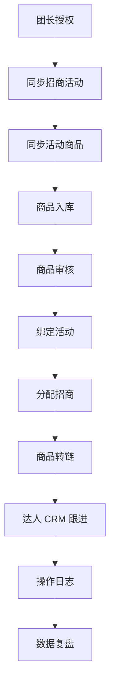

# 01 业务闭环

更新时间：2026-04-25

## 业务闭环一句话

> 从团长拿到活动和商品开始，到商品被达人推广、产生转链或合作结果，最后这些结果回流系统，反哺商品、达人和活动运营决策。

## 当前 MVP 闭环

当前第一阶段闭环定义为：

`授权 -> 同步活动 -> 同步活动商品 -> 商品入库 -> 商品审核 -> 绑定活动 -> 分配招商 -> 商品转链 -> 达人跟进 -> 操作日志 -> 页面统一展示`

## 主链路流程

## 主链路拆解

### 1. 团长授权

目标：

- 确认当前授权主体
- 获取可用 token
- 校验是否具备招商团长权限

当前状态：

- Token 链路已经抽象到 `DouyinAuthGateway`
- 真实权限校验和异常分支仍待继续完善

### 2. 同步招商活动

目标：

- 获取活动列表
- 查看活动状态和规则
- 为活动商品同步提供业务容器

当前状态：

- 活动查询已通过 `DouyinColonelActivityGateway` 提供

### 3. 同步活动商品

目标：

- 通过活动拉取商品
- 建立商品与活动的业务关联
- 保存同步快照和来源信息

当前状态：

- 活动商品查询已收口到活动 Gateway
- 商品快照已落到 `product_snapshot`
- 同步批次、授权主体标识仍需增强

### 4. 商品入库

商品进入系统后必须能回答：

- 来自哪个活动
- 属于哪个授权主体
- 是哪次同步入库
- 当前处于什么业务状态

### 5. 商品审核

目标：

- 让商品进入可运营状态
- 审核动作必须留痕

当前状态：

- 已有审核接口
- 业务状态机仍需统一

### 6. 绑定活动

目标：

- 明确商品绑定到哪个运营活动
- 记录绑定前后状态和操作人

### 7. 分配招商人员

目标：

- 明确商品当前负责人
- 为后续达人推进和复盘提供责任归属

### 8. 商品转链

目标：

- 把商品转成可推广链接
- 保存推广链接、短链、口令、失效时间等结果

当前状态：

- 已通过 `DouyinPromotionGateway` 收口
- 转链结果已写入当前商品操作状态

### 9. 达人 CRM 跟进

达人 CRM 不是独立列表，而是为商品推进服务。最小闭环应回答：

- 这个商品推给了谁
- 当前跟进到哪一步
- 是否达成合作
- 是否有转化结果

当前建议状态：

- `未联系`
- `已邀约`
- `已回复`
- `已合作`
- `推广中`
- `有转化`
- `无转化`
- `已终止`

当前状态：

- 达人基础模块已存在
- 商品维度的达人跟进已开始并入主链路
- 当前 MVP 以 `LINKED -> FOLLOWING` 为入口
- `FOLLOWING -> FOLLOWING` 允许追加跟进记录，但不重复推进商品主状态

### 10. 操作日志

目标：

- 所有关键动作可追踪

当前状态：

- 已有 `product_operation_log`
- 已开始接入 `before_status / after_status`
- 审核、绑定、分配、转链开始围绕统一 `biz_status` 留痕

建议关键字段：

- `product_id`
- `activity_id`
- `operation_type`
- `before_status`
- `after_status`
- `operator_id`
- `operator_name`
- `remark`
- `created_at`
- `success`
- `error_message`

### 11. 数据复盘

当前阶段不强求真实订单回流闭环，但后续需要承接：

- 商品维度表现
- 达人维度合作效果
- 活动维度整体产出

## 商品主链路状态建议

建议统一为：

- `已同步`
- `待审核`
- `已通过`
- `已拒绝`
- `已绑定活动`
- `已分配招商`
- `已转链`
- `推广中`
- `有转化`
- `无转化`

当前代码口径已开始落到：

- `PENDING_AUDIT`
- `APPROVED`
- `REJECTED`
- `BOUND`
- `ASSIGNED`
- `LINKED`
- `FOLLOWING`

## 达人信息来源策略

达人信息获取遵循下面优先级：

1. `OFFICIAL_API`
2. `MANUAL`
3. `INTERNAL_BUSINESS`
4. `THIRD_PARTY`
5. `PUBLIC_PAGE`

原则：

- 生产主路径优先官方授权 API、达人主动提交和内部业务沉淀
- 公开页面抓取只能作为低频辅助能力，且默认关闭

## 判断闭环是否成立的 5 个问题

1. 数据有没有来源
2. 状态有没有流转
3. 操作有没有记录
4. 结果有没有保存
5. 结果能不能反向指导下一步

## 当前 P0 定义

P0 不是“商品页可用”，而是：

> 活动商品入库 -> 商品审核 -> 绑定活动 -> 转链 -> 达人跟进 -> 操作记录 -> 页面统一展示
