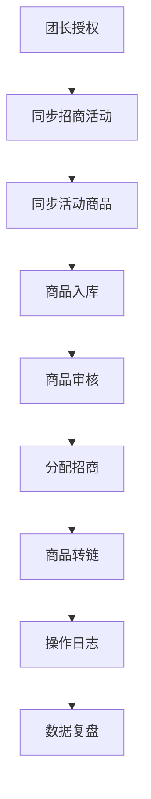

# 01 业务闭环

更新时间：2026-04-25

## 业务闭环一句话

> 从团长拿到活动和商品开始，到商品完成入库、审核、绑定、分配、转链与订单回流，最后这些结果回流系统，反哺商品、达人和活动运营决策。

## 开发与验收准则

后续开发统一遵循：

> **开发角度看功能是否闭环，用户角度看业务是否顺手。**

这句话的落地口径是：

- 不按“页面是否存在”验收，而按“业务链路是否跑通”验收
- 不只看接口 200，而看用户是否完成真实动作并得到结果反馈
- 不只展示成功结果，失败和未归因等异常也必须可见、可解释、可追溯
- 页面组织优先服务角色任务，而不是堆模块入口
- 每个核心动作都要能回答谁操作、何时操作、结果如何、失败原因是什么

## 当前 MVP 闭环

当前第一阶段闭环定义为：

`授权 -> 同步活动 -> 同步活动商品 -> 商品入库 -> 商品审核 -> 分配招商 -> 商品转链 -> 操作日志 -> 页面统一展示`

## 主链路流程

## 主链路拆解

### 1. 团长授权

目标：

- 确认当前授权主体
- 获取可用 token
- 校验是否具备招商团长权限

当前状态：

- Token 链路已经抽象到 `DouyinAuthGateway`
- 真实权限校验和异常分支仍待继续完善

### 2. 同步招商活动

目标：

- 获取活动列表
- 查看活动状态和规则
- 为活动商品同步提供业务容器

当前状态：

- 活动查询已通过 `DouyinColonelActivityGateway` 提供

### 3. 同步活动商品

目标：

- 通过活动拉取商品
- 建立商品与活动的业务关联
- 保存同步快照和来源信息

当前状态：

- 活动商品查询已收口到活动 Gateway
- 商品快照已落到 `product_snapshot`
- 同步批次、授权主体标识仍需增强

### 4. 商品入库

商品进入系统后必须能回答：

- 来自哪个活动
- 属于哪个授权主体
- 是哪次同步入库
- 当前处于什么业务状态

### 5. 商品审核

目标：

- 让商品进入可运营状态
- 审核动作必须留痕

当前状态：

- 已有审核接口
- 业务状态机仍需统一

### 6. 分配招商人员

目标：

- 明确商品当前负责人
- 为后续渠道推广、订单归因和复盘提供责任归属

### 7. 商品转链

目标：

- 把商品转成可推广链接
- 保存推广链接、短链、口令、失效时间等结果

当前状态：

- 已通过 `DouyinPromotionGateway` 收口
- 转链结果已写入当前商品操作状态

### 8. 商品库与达人 CRM 的边界

当前口径调整为：

- 商品库只保留商品域信息，包括商品基础资料、活动归属、招商负责人、转链结果、订单反馈、操作日志
- 达人邀约、跟进、寄样、合作状态、转化判断统一放到达人 CRM 中处理
- 商品库可以展示“已转交达人 CRM”这类只读状态，但不再承担达人侧录入和操作入口

这样做的目标是：

- 渠道在商品库完成选品、看规则、取链接
- 招商在商品库完成审核、绑定、分配
- 达人跟进人员在达人 CRM 完成后续协作动作

### 9. 操作日志

目标：

- 所有关键动作可追踪

当前状态：

- 已有 `product_operation_log`
- 已开始接入 `before_status / after_status`
- 审核、绑定、分配、转链开始围绕统一 `biz_status` 留痕

建议关键字段：

- `product_id`
- `activity_id`
- `operation_type`
- `before_status`
- `after_status`
- `operator_id`
- `operator_name`
- `remark`
- `created_at`
- `success`
- `error_message`

### 10. 数据复盘

当前阶段不强求真实订单回流闭环，但后续需要承接：

- 商品维度表现
- 达人维度合作效果
- 活动维度整体产出

## 商品主链路状态建议

建议统一为：

- `已同步`
- `待审核`
- `已通过`
- `已拒绝`
- `历史已绑定`
- `已分配招商`
- `已转链`
- `推广中`
- `有转化`
- `无转化`

当前代码口径已开始落到：

- `PENDING_AUDIT`
- `APPROVED`
- `REJECTED`
- `BOUND`（历史兼容）
- `ASSIGNED`
- `LINKED`
- `FOLLOWING`

说明：

- `FOLLOWING` 作为兼容状态保留，用于表示商品已转交达人 CRM 跟进
- 商品库前端不再提供 `FOLLOWING` 的操作入口，只做只读展示

## 达人信息来源策略

达人信息获取遵循下面优先级：

1. `OFFICIAL_API`
2. `MANUAL`
3. `INTERNAL_BUSINESS`
4. `THIRD_PARTY`
5. `PUBLIC_PAGE`

原则：

- 生产主路径优先官方授权 API、达人主动提交和内部业务沉淀
- 公开页面抓取只能作为低频辅助能力，且默认关闭

## 判断闭环是否成立的 5 个问题

1. 数据有没有来源
2. 状态有没有流转
3. 操作有没有记录
4. 结果有没有保存
5. 结果能不能反向指导下一步

## 前端联调验收补充

前端联调优先按用户故事和业务链路推进，而不是按菜单逐页盲测。

当前 P0 联调主链路应优先验证：

`商品库列表 -> 商品详情 -> 一键复制推广链接 -> 后端自动处理订单同步 -> 订单明细 -> 归因/未归因状态展示 -> 数据平台基础统计`

对应验收关注点：

- 商品库：渠道能快速筛选商品、查看卖点和寄样要求、复制可推广链接
- 订单回流：可归因与未归因订单都能展示，未归因原因清晰可见
- 数据平台：能回答谁出了单、哪个商品有效、哪些订单未归因
- 异常反馈：转链失败、无权限、无映射、无 `pick_source` 等场景前端必须给出明确提示

## 当前 P0 定义

P0 不是“商品页可用”，而是：

> 活动商品入库 -> 商品审核 -> 分配招商 -> 转链 -> 操作记录 -> 页面统一展示
