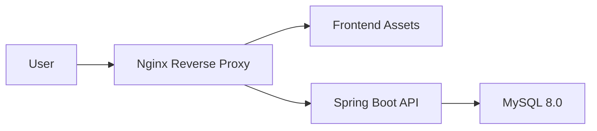

# 02-架构设计

更新时间：2026-04-21

## 一、技术栈

- **后端**：Spring Boot 3.x, MySQL 8.0, MyBatis Plus
- **前端**：Vue 3, Vite, Naive UI, Pinia
- **基础设施**：Docker Compose, Nginx

## 二、核心逻辑架构

系统采用插件化的 Gateway 模式，实现业务逻辑与第三方平台（抖店/星图）的解耦。

### 1. Gateway 模式
- **Interface 层**：定义业务契约（如 `DouyinOrderGateway`）。
- **Mock 实现**：用于 `test` 环境，返回本地构造的演示数据。
- **Real 实现**：用于 `real` 环境，调用正式 SDK 接口。

### 2. 状态机模型
商品与寄样均采用严格的状态机控制，确保业务流向合规。
- **商品状态**：`PENDING_AUDIT` -> `APPROVED` -> `ASSIGNED` -> `LINKED`。
- **寄样状态**：`PENDING_AUDIT` -> `PENDING_SHIP` -> `SHIPPED` -> `FINISHED`。

## 三、部署架构

- **容器化**：通过 `docker-compose.yml` 一键拉起数据库与后端服务。
- **前后端分离**：前端静态资源由 Nginx 托管，API 请求转发至后端。

## 四、关键设计决策

1. **UUID 作为主键**：统一使用 UUID 防止 ID 遍历，提高系统安全性。
2. **逻辑删除**：所有业务数据均保留 `deleted` 标记，便于审计。
3. **软归因策略**：当订单无法通过标识归因时，支持进入“待排查”池，由人工基于商品 ID 和下单时间进行二次匹配。
