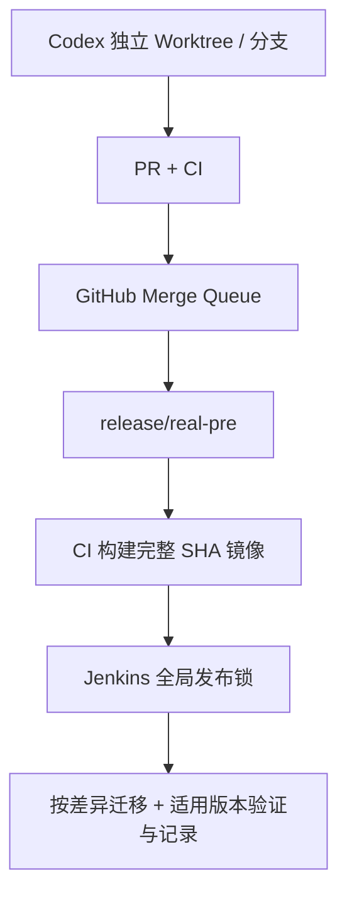

# 部署运行总览

## 当前口径

- 本地验证继续使用 Docker Compose：`docker-compose.test.yml` 与 `docker-compose.real-pre.yml`。
- 远端 real-pre 使用 Docker Compose，但只允许 Jenkins 单通道发布。
- 多个 Codex 任务可以并行分析、编码和测试；PR 合并、数据库迁移、远端 E2E、部署与回滚必须串行。
- 普通 Codex 任务只能提交候选变更和证据，不得 SSH、直接部署、改服务器 env 或共享工作树。



## 分支与权限

| 分支/角色 | 职责 |
| --- | --- |
| `codex/task-*` | 独立开发、测试、推送、PR、候选 evidence |
| 集成分支 | 汇总业务切片，但不能直接部署 |
| `release/real-pre` | 唯一可构建和部署 real-pre 的分支 |
| `main` | 生产分支；生产发布需单独审批 Job |
| Jenkins | 唯一持有 real-pre 发布权限的控制器 |

GitHub 是代码与 Merge Queue 主源；Gitee 只可作为镜像，不参与发布版本判定。

## 本地环境

| 环境 | Compose | 端口 | 用途 |
| --- | --- | --- | --- |
| test | `docker-compose.test.yml` | 前端 3000、后端 8080 | mock、单元、E2E 回归 |
| 本地 real-pre | `docker-compose.real-pre.yml` | 前端 3001、后端 8081 | 默认工程构建、重启、真实配置验证 |

本地修改仍通过 `harness/scripts/commands/agent-do.ps1` 执行构建、重启、健康检查、业务验证和 evidence。`-DeployRemote true` 已停用。

real-pre 必须保持：

- `APP_TEST_ENABLED=false`；
- `DOUYIN_TEST_ENABLED=false`；
- `DOUYIN_REAL_UPSTREAM_MODE=live`；
- PostgreSQL / Redis 不对公网暴露；
- 禁止清库、删除 volume 或用 mock 证明真实闭环。

## 远端目录

```text
/opt/saas/env/.env.real-pre          固定配置，不由发布任务修改
/opt/saas/releases/<完整SHA>/        不可变 release.json、Compose 和运行证据
/opt/saas/releases/current.json      当前验证通过版本
/opt/saas/releases/previous.json     上一个可回滚版本
```

服务器不再使用 `/opt/saas/app` 共享可变工作树进行 `git pull`、`checkout`、`reset`、改 Compose 或现场构建。

## 单通道发布流程

1. PR 必需 CI 通过；Merge Queue 使用 `merge_group` 再验证并串行合并。
2. 只有 `release/real-pre` 的 push 触发 `.github/workflows/release-images.yml`。
3. CI 构建、测试产物并推送后端/前端镜像；tag 为 40 位完整 SHA。
4. CI 记录两个镜像 digest，并把 SHA、镜像仓库和 digest 传给 Jenkins。
5. Jenkins 使用 `disableConcurrentBuilds(abortPrevious: false)` 排队。
6. 部署阶段再获取 `saas-real-pre-deploy` 全局锁，比较当前/目标 SHA；仅迁移路径变化时串行执行数据库迁移。
7. Jenkins 只拉镜像，不运行 Maven、pnpm、Docker build。
8. 应用、镜像和本次适用的数据库门禁全部通过后，才更新 `current.json` 并写 `DEPLOYMENT=PASS`。

## 不可变镜像门禁

每个镜像必须同时满足：

- tag 等于目标完整 Git SHA；
- OCI `org.opencontainers.image.revision` 等于目标 SHA；
- 本地 `RepoDigest` 等于发布清单 digest；
- Compose 使用 `repository@sha256:digest`；
- 禁止 `latest`、短 SHA、`real-pre` 可变发布 tag 和临时本地 tag。

旧任务晚到时，`scripts/deploy-release.sh` 执行：

```bash
git merge-base --is-ancestor "$CURRENT_SHA" "$TARGET_SHA"
```

非后继提交必须失败；只有经过同一 Jenkins 队列且显式 `ROLLBACK_APPROVED=true` 才允许回滚。

## 运行版本验证

后端 `/api/system/health` 返回：

```json
{
  "status": "UP",
  "gitSha": "完整 SHA",
  "imageDigest": "sha256:...",
  "databaseMigrationVersion": "migrate-all.sql@checksum",
  "flywayVersion": "20260718.001"
}
```

前端 `/version.json` 返回同一 `gitSha`。Jenkins 始终核对目标 SHA、前后端运行 SHA和镜像 SHA/digest；只有发布清单的 `databaseMigration.required=true` 时才强制核对 `schema_migration_log` 与 `flyway_schema_history`。

无迁移发布仍记录数据库/Flyway 观测值，但不执行数据库写操作，也不因 `NOT_MANAGED` 单独失败。需要迁移时，`UNAVAILABLE`、`NOT_MANAGED`、缺字段或任一不一致都不能记为 PASS。容器健康只说明进程可用，不等于业务闭环或发布版本正确。

## Flyway 切换门槛

项目已接入 Flyway 依赖和迁移集成测试，但 `.env.real-pre.example` 默认 `FLYWAY_ENABLED=false`，防止未经演练自动修改真实数据库。正式发布前必须：

1. 备份数据库并在等价 PostgreSQL 版本演练；
2. 验证 baseline `20260717` 与全部 `db/migrate/V*.sql`；
3. 由服务器配置负责人显式启用 `FLYWAY_ENABLED=true`；
4. 验证 `flyway_schema_history` 与发布清单一致。

以上步骤仅适用于包含数据库迁移的发布；未完成时 Jenkins 必须 BLOCKED。纯 Harness、文档或普通应用变更不触发该迁移门槛。

## 已停用入口

- `agent-do.ps1 -DeployRemote true`；
- `harness/scripts/commands/deploy-remote.ps1`；
- `scripts/deploy-real-pre.sh`；
- `scripts/rollback-real-pre.sh`；
- 任何 SSH + `git pull` + `docker compose up --build` 手工流程。

历史手工部署文档只保留问题背景，不再是执行事实。当前发布策略以 `harness/rules/cicd-real-pre-policy.md` 为准。
