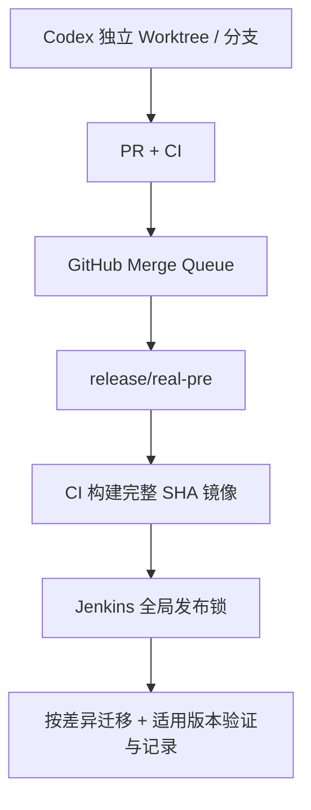

# 部署运行总览

## 当前口径

- 本地验证继续使用 Docker Compose：`docker-compose.test.yml` 与 `docker-compose.real-pre.yml`。
- 远端 real-pre 使用 Docker Compose，但只允许 Jenkins 单通道发布。
- 多个 Codex 任务可以并行分析、编码和测试；PR 合并、数据库迁移、远端 E2E、部署与回滚必须串行。
- 普通 Codex 任务只能提交候选变更和证据，不得 SSH、直接部署、改服务器 env 或共享工作树。

<<<<<<< HEAD
- [V1 必做] 当前运行以 Docker Compose 管理 PostgreSQL、Redis、后端和前端。
- [V1 必做] 本机常用端口组为 `3000/8080` 与 `3001/8081`，不得混起第二个 `3001` Vite 或额外 `8080` 后端。
- [V1 必做] real-pre 典型公网/宿主机端口为前端 `3001`、后端 `8081`；PostgreSQL `5432` 与 Redis `6379` 仅在 Compose 网络内访问，不对公网暴露。
- [V1 必做] real-pre 必须关闭 mock：`APP_TEST_ENABLED=false`、`DOUYIN_TEST_ENABLED=false`。
- [V1 必做] 当前只保留两个环境：`test` 测试环境与 `real-pre` 真实上游 / 生产形态环境；旧 `dev`、`local-mock`、`real`、`prod` 入口已合并或删除。

## 环境清单

| 环境 | Compose / 配置 | 用途 | 验证 | 范围 |
| --- | --- | --- | --- | --- |
| test | `docker-compose.test.yml`、`.env.test` | 本地 mock / P0 回归 | E2E、API、SQL | V1 必做 |
| real-pre | `docker-compose.real-pre.yml`、`.env.real-pre` | 真实联调、上线前验收和当前生产形态部署 | preflight、真实接口、日志、迁移记录 | V1 必做 |

## 部署前检查

- [V1 必做] 环境变量不包含过期 Token、测试开关误开或端口冲突。
- [V1 必做] PostgreSQL 和 Redis 容器健康。
- [V1 必做] 后端 profile、数据库连接、Redis 连接、第三方配置在启动日志中可证。
- [V1 必做] 前端目标 API 地址指向当前环境后端。
- [V1 必做] real-pre 跑验收前执行预检命令。
- [V1 必做] 部署允许条件：构建产物、数据库迁移、环境变量、真实 API Token、Redis/PostgreSQL、日志目录、证据目录全部确认；real-pre 上游读、同步、刷新、回调和写入类开关默认开启，包括真实推广写双开关 `DOUYIN_REAL_PROMOTION_WRITE_ENABLED=true` 与 `ALLOW_REAL_PROMOTION_WRITE=true`。如因风控、上游冻结或只读排障临时关闭，必须记录原因、影响范围和恢复计划。
- [V1 必做] 数据库备份和迁移由 Jenkins 根据当前 SHA 到目标 SHA 的迁移文件 diff 决定；没有数据库变更时明确跳过，普通 Agent 不得强制执行远端数据库操作。

## 服务器 real-pre 受控部署结论

- [V1 必做] 当前状态达到“服务器 real-pre 受控部署验证”门槛，但未达到“real-pre P0 全量通过”门槛。
- [V1 必做] 部署目标是进入真实样本采集与真实订单闭环验证阶段，不是正式生产放量。
- [V1 必做] 允许：服务器 real-pre 受控部署。
- [V1 必做] 不允许：宣称 real-pre P0 完全通过 / 可正式全量上线。
- [V1 必做] 部署后第一轮验收固定执行 `npm run e2e:real-pre:p0:preflight`、`npm run e2e:real-pre:p0`、`npm run e2e:real-pre:roles`。

| 部署后结果 | 结论 | 范围 |
| --- | --- | --- |
| 无失败 + 无真实订单 | real-pre 环境部署成功，P0 仍因真实样本不足保持 PENDING | V1 必做 |
| 无失败 + 有真实订单 + 归因 / 寄样 / 业绩通过 | real-pre P0 可升级为通过 | V1 必做 |
| 出现失败 | 按失败项定级回滚或修复，不得放量 | V1 必做 |

## Jenkins 单通道 real-pre 受控部署

- [V1 必做] 当前采用单机 Docker Compose + Jenkins 唯一发布队列；不需要 Kubernetes，也不允许普通 Agent 手工 SSH 部署。
- [V1 必做] 服务器目录固定为 `/opt/saas/app`、`/opt/saas/env`、`/opt/saas/logs`、`/opt/saas/backups`、`/opt/saas/releases`、`/opt/saas/runtime/qa/out`。
- [V1 必做] `main` 是唯一集成主线，`release/real-pre` 是唯一部署来源；服务器运行内容由完整 SHA 镜像和 `/opt/saas/releases/*.json` 标识，不再以共享工作树反复 checkout/pull/reset 作为版本事实。
- [V1 必做] real-pre 部署复用 `docker-compose.real-pre.yml` 与只读的 `/opt/saas/env/.env.real-pre`，固定端口为前端 `3001`、后端 `8081`、PostgreSQL 容器内 `5432`、Redis 容器内 `6379`，数据库和 Redis 不对公网暴露。
- [V1 必做] real-pre 不是 `docker-compose.test.yml` 的 mock/test 基线，必须保持 `APP_TEST_ENABLED=false`、`DOUYIN_TEST_ENABLED=false`、`DOUYIN_REAL_UPSTREAM_MODE=live`，数据库必须为 `saas_real_pre`。real-pre 默认开启真实推广写双开关，商品库“复制简介”会触发真实 `buyin.instPickSourceConvert` 并写入 `pick_source_mapping`；验收和排障必须按真实上游副作用记录证据。
- [V1 必做] 发布顺序为任务分支 PR/CI、串行合并 `main`、发布提升 PR、`release/real-pre`、Jenkins 全局锁、顺序检查、不可变镜像、按需数据库步骤、backend/frontend 部署、版本一致性、real-pre 验收、发布清单和 evidence。
- [V1 必做] 端口验活使用公开探针 `/api/system/health` 和前端 `/login`，不使用需要鉴权的 `/api/actuator/health` 作为无鉴权健康检查。
- [V1 必做] Compose project 固定为 `saas-active`，与当前 real-pre 启动脚本、容器名和 QA 默认 DB 容器一致；不要切回旧 project 导致创建第二套数据卷。
- [V1 必做] 完整域名部署时，宝塔只负责站点、SSL、Nginx 反代、防火墙和监控；Docker Compose 仍负责 PostgreSQL、Redis、backend、frontend。
- [V1 必做] 完整域名部署的公网入口统一为 `https://real-pre.<domain>`，Nginx 将 `/api/` 反代到 `127.0.0.1:8081/api/`，将 `/` 反代到 `127.0.0.1:3001/`。
- [V1 必做] 抖店 OAuth 回调、OAuth 成功 / 失败页、快递100订阅回调和 CORS 必须使用同一个 HTTPS real-pre 域名；不得在百应后台继续保留临时 IP + 端口地址。
- [V1 必做] Nginx / SSL 验收通过后，云安全组和宝塔防火墙只保留 `80/443/22/宝塔面板受限端口`，关闭公网 `8081/3001/5432/6379`。
- [V1 必做] 部署允许 real-pre 短暂中断；不得加 `-v`，避免清空 real-pre 数据卷。
- [V1 必做] `npm run e2e:real-pre:p0:preflight`、`npm run e2e:real-pre:p0`、`npm run e2e:real-pre:roles` 执行结果必须进入部署报告；`BLOCKED` / `PENDING` 不能记为通过。
- [V1 必做] 每次部署必须归档 Compose 状态、后端 / 前端 / PostgreSQL / Redis 日志、`/opt/saas/logs/**`、`runtime/qa/out/**`、`playwright-report/**` 和 `test-results/playwright/**`。
- [V1 必做] 抖店 OAuth 回调到受保护页面时必须保留登录后回跳目标；未登录浏览器进入 `/system/douyin?oauth=success` 后跳 `/login?redirect=...`，登录成功后回到抖店联调页继续刷新 Token 状态。
- [V1 必做] 巨量百应官方授权管理页为 `https://buyin.jinritemai.com/dashboard/institution/power-manage`；它用于人工检查或开通授权主体能力，不替代 OAuth code 回调换 Token 链路。

## 当前代码到服务器发布步骤

- [V1 必做] 所有开发从 `main` 创建 `codex/<issue>-<slug>` 独立分支和 worktree。
- [V1 必做] 任务完成后提交 PR，CI 通过并串行合并到 `main`；禁止直接推送 `main` / `release/real-pre`。
- [V1 必做] 发布控制器创建从目标 `main` 提交到 `release/real-pre` 的提升 PR；一次只合并一个候选。
- [V1 必做] Jenkins Job `saas-real-pre-cd` 只接受 `DEPLOY_BRANCH=release/real-pre`，并通过 `saas-real-pre-deploy` 全局锁排队。
- [V1 必做] `.env.real-pre`、`.env.test`、`.env` 不进入 Git；服务器真实环境文件固定为 `/opt/saas/env/.env.real-pre`，发布任务不得修改。
- [V1 必做] 目标不是当前部署版本后继提交时默认拒绝，只有批准回滚才能设置 `ROLLBACK_APPROVED=true`。
- [V1 必做] 无迁移输入变化时 `RUN_DB_MIGRATIONS=false`，跳过远端备份、迁移和 Schema 预检；有变化时才执行受控数据库链路。
- [V1 必做] 发布完成后同时核对 Jenkins SHA、后端 `gitSha/imageDigest`、前端 `/version.json`、Docker SHA/摘要和 Flyway 成功版本。

发布指针：

```text
/opt/saas/releases/<完整SHA>/release.json
/opt/saas/releases/current.json
/opt/saas/releases/previous.json
```

只有健康、版本、镜像、数据库版本和业务验证全部通过后，Jenkins 才原子更新 `current.json`。
=======

```mermaid
flowchart TD
    A["Codex 独立 Worktree / 分支"] --> B["PR + CI"]
    B --> C["GitHub Merge Queue"]
    C --> D["release/real-pre"]
    D --> E["CI 构建完整 SHA 镜像"]
    E --> F["Jenkins 全局发布锁"]
    F --> G["按差异迁移 + 适用版本验证与记录"]
```

## 分支与权限

| 分支/角色 | 职责 |
| --- | --- |
| `codex/task-*` | 独立开发、测试、推送、PR、候选 evidence |
| 集成分支 | 汇总业务切片，但不能直接部署 |
| `release/real-pre` | 唯一可构建和部署 real-pre 的分支 |
| `main` | 生产分支；生产发布需单独审批 Job |
| Jenkins | 唯一持有 real-pre 发布权限的控制器 |

GitHub 是代码与 Merge Queue 主源；Gitee 只可作为镜像，不参与发布版本判定。

## 本地环境

| 环境 | Compose | 端口 | 用途 |
| --- | --- | --- | --- |
| test | `docker-compose.test.yml` | 前端 3000、后端 8080 | mock、单元、E2E 回归 |
| 本地 real-pre | `docker-compose.real-pre.yml` | 前端 3001、后端 8081 | 默认工程构建、重启、真实配置验证 |

本地修改仍通过 `harness/scripts/commands/agent-do.ps1` 执行构建、重启、健康检查、业务验证和 evidence。`-DeployRemote true` 已停用。

real-pre 必须保持：

- `APP_TEST_ENABLED=false`；
- `DOUYIN_TEST_ENABLED=false`；
- `DOUYIN_REAL_UPSTREAM_MODE=live`；
- PostgreSQL / Redis 不对公网暴露；
- 禁止清库、删除 volume 或用 mock 证明真实闭环。

## 远端目录

```text
/opt/saas/env/.env.real-pre          固定配置，不由发布任务修改
/opt/saas/releases/<完整SHA>/        不可变 release.json、Compose 和运行证据
/opt/saas/releases/current.json      当前验证通过版本
/opt/saas/releases/previous.json     上一个可回滚版本
```

服务器不再使用 `/opt/saas/app` 共享可变工作树进行 `git pull`、`checkout`、`reset`、改 Compose 或现场构建。

## 单通道发布流程

1. PR 必需 CI 通过；Merge Queue 使用 `merge_group` 再验证并串行合并。
2. 只有 `release/real-pre` 的 push 触发 `.github/workflows/release-images.yml`。
3. CI 构建、测试产物并推送后端/前端镜像；tag 为 40 位完整 SHA。
4. CI 记录两个镜像 digest，并把 SHA、镜像仓库和 digest 传给 Jenkins。
5. Jenkins 使用 `disableConcurrentBuilds(abortPrevious: false)` 排队。
6. 部署阶段再获取 `saas-real-pre-deploy` 全局锁，比较当前/目标 SHA；仅迁移路径变化时串行执行数据库迁移。
7. Jenkins 只拉镜像，不运行 Maven、pnpm、Docker build。
8. 应用、镜像和本次适用的数据库门禁全部通过后，才更新 `current.json` 并写 `DEPLOYMENT=PASS`。

## 不可变镜像门禁

每个镜像必须同时满足：

- tag 等于目标完整 Git SHA；
- OCI `org.opencontainers.image.revision` 等于目标 SHA；
- 本地 `RepoDigest` 等于发布清单 digest；
- Compose 使用 `repository@sha256:digest`；
- 禁止 `latest`、短 SHA、`real-pre` 可变发布 tag 和临时本地 tag。

旧任务晚到时，`scripts/deploy-release.sh` 执行：

```bash
git merge-base --is-ancestor "$CURRENT_SHA" "$TARGET_SHA"
```

非后继提交必须失败；只有经过同一 Jenkins 队列且显式 `ROLLBACK_APPROVED=true` 才允许回滚。

## 运行版本验证

后端 `/api/system/health` 返回：

```json
{
  "status": "UP",
  "gitSha": "完整 SHA",
  "imageDigest": "sha256:...",
  "databaseMigrationVersion": "migrate-all.sql@checksum",
  "flywayVersion": "20260718.001"
}
```

前端 `/version.json` 返回同一 `gitSha`。Jenkins 始终核对目标 SHA、前后端运行 SHA和镜像 SHA/digest；只有发布清单的 `databaseMigration.required=true` 时才强制核对 `schema_migration_log` 与 `flyway_schema_history`。

无迁移发布仍记录数据库/Flyway 观测值，但不执行数据库写操作，也不因 `NOT_MANAGED` 单独失败。需要迁移时，`UNAVAILABLE`、`NOT_MANAGED`、缺字段或任一不一致都不能记为 PASS。容器健康只说明进程可用，不等于业务闭环或发布版本正确。

## Flyway 切换门槛
>>>>>>> b8cb837b (refactor: establish real-pre single-channel CD)

项目已接入 Flyway 依赖和迁移集成测试，但 `.env.real-pre.example` 默认 `FLYWAY_ENABLED=false`，防止未经演练自动修改真实数据库。正式发布前必须：

1. 备份数据库并在等价 PostgreSQL 版本演练；
2. 验证 baseline `20260717` 与全部 `db/migrate/V*.sql`；
3. 由服务器配置负责人显式启用 `FLYWAY_ENABLED=true`；
4. 验证 `flyway_schema_history` 与发布清单一致。

以上步骤仅适用于包含数据库迁移的发布；未完成时 Jenkins 必须 BLOCKED。纯 Harness、文档或普通应用变更不触发该迁移门槛。

## 已停用入口

- `agent-do.ps1 -DeployRemote true`；
- `harness/scripts/commands/deploy-remote.ps1`；
- `scripts/deploy-real-pre.sh`；
- `scripts/rollback-real-pre.sh`；
- 任何 SSH + `git pull` + `docker compose up --build` 手工流程。

历史手工部署文档只保留问题背景，不再是执行事实。当前发布策略以 `harness/rules/cicd-real-pre-policy.md` 为准。
