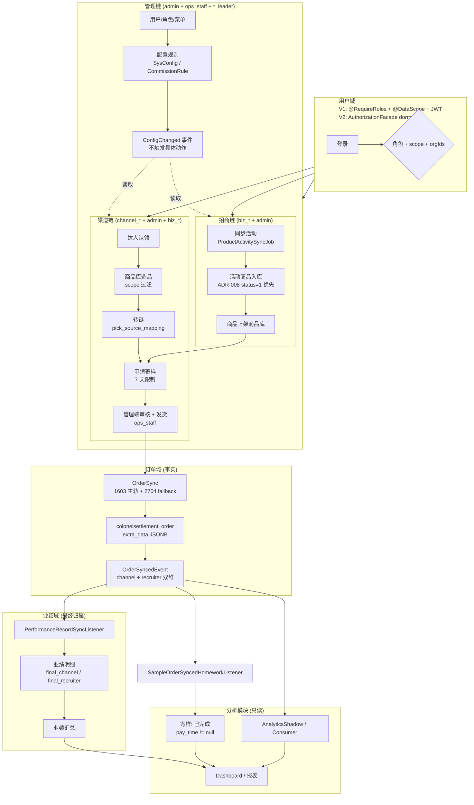

# 13-业务流程总图

> 范围标记：`V1 必做`、`V1 简化`、`V1 不做`、`V2 预留`、`历史归档`。
> 编写日期：2026-08-29。本文是 [02-V1业务流程与领域设计.md](02-V1业务流程与领域设计.md) + [02-业务闭环总览.md](02-业务闭环总览.md) + [02-业务闭环地图.md](02-业务闭环地图.md) 的代码级索引，不重复维护第二套事实。

## 一、本文定位

[V1 必做] 用一张总图 + 三条主链 + 事件总线 + 权限治理四个视角，把当前 V1 业务的真实链路复述到代码与 ADR。范围不扩张；与旧 [归档/旧版V2.2完整方案.md](归档/旧版V2.2完整方案.md) 不混合。

[V1 必做] 阅读顺序：
1. [00-项目总览.md](00-项目总览.md)
2. [02-业务闭环总览.md](02-业务闭环总览.md)
3. 本文
4. 各流程子文档（[流程/](流程/)）+ 各领域合同（[领域/](领域/)）
5. 决策索引（[决策/](决策/)）

## 二、业务总图



## 三、三条主链

### 3.1 渠道链

[V1 必做] 入口到出口：登录 → 选品（按 scope 过滤）→ 转链 → 申请寄样 → 管理端审核 / 发货 → 订单同步 → 业绩归属 → 寄样自动完成 → dashboard。

| 步骤 | 代码 / 文件锚点 | 关键约束 |
|---|---|---|
| 登录 | `controller/auth/*` + `domain/user/api/CurrentUserProvider` + `aspect/RoleGuardAspect` | 用户域合同 §"登录账号"；JWT `roleCodes` + `dataScope` |
| 商品列表 | `controller/ColonelActivityProductQueryController`、`ProductController` | 07-权限 L46：活动列表非 admin 强制 `mine`；ADR-008 上游推广中优先 |
| 转链 | `controller/ColonelActivityProductController#copyPromotion` + `domain/product/*CopyPromotionApplicationService` | 商品域落 `pick_source_mapping`；寄样域合同 L59：活动 ID + 抖音商品 ID + 达人推广标识三件齐 |
| 寄样申请 | `controller/SampleController` | 寄样域合同 L41：7 天重复申请限制（admin / channel_leader 可豁免） |
| 审核 / 发货 | `SampleController` + `controller/AdminSampleLogisticsController` | 寄样域合同 L42-44：发货仅 `ops_staff` / `admin` |
| 订单同步 | `job/OrderSyncJob` + `OrderController` + `OrderAttributionController` | 订单域合同 L26-28 + ADR-009：`effective_*` 只来自上游；2704 不得作主链路 |
| 订单事件 | `event/OrderSyncedEvent.java` → `Outbox` → `job/DomainEventDispatcherJob` | 04-事件 L22、L28-32：双维状态只表达输入，不表达最终归属 |
| 业绩归属 | `listener/PerformanceRecordSyncListener` → `domain/performance/*` | ADR-004：业绩域是最终归属唯一来源；`final_channel = default_channel` |
| 寄样自动完成 | `listener/SampleOrderSyncedHomeworkListener` | 02-V1 L184：`pay_time != null` 且 渠道+达人+商品匹配 |
| dashboard | `controller/DashboardController` | ADR-005：只读汇总，不重算 |

详细流程：[流程/渠道主链路.md](流程/渠道主链路.md)。

### 3.2 招商链

[V1 必做] 入口到出口：招商组长同步活动 → 活动商品入库 → 商品上架商品库 → 招商或渠道发起寄样 → 审核 → 发货 → 订单同步 → 招商业绩。

| 步骤 | 代码 / 文件锚点 | 关键约束 |
|---|---|---|
| 同步活动 | `controller/ColonelActivityController` + `job/ProductActivitySyncJob` | `colonel_activity.activity_status_code` 只存抖店活动状态，不推导商品状态 |
| 商品入库 + 上架 | `controller/ColonelActivityProductLibraryController` + `ProductLibraryRepairController` | ADR-008 §1：`status=1` 自动补齐上架字段；历史 REJECTED 不阻断 |
| 寄样审核 | `SampleController`（approve） | 寄样域合同 L41：招商角色不套渠道私海约束 |
| 招商业绩 | `PerformanceRecordSyncListener` + `domain/performance/*` | 02-V1 L55：默认招商归因按"活动绑定招商"；不引入个别品负责人覆盖 |

详细流程：[流程/招商主链路.md](流程/招商主链路.md)。

### 3.3 管理链

[V1 必做] 入口到出口：管理员登录 → 用户 / 角色 / 组织 / 菜单维护 → 配置规则修改 → 配置已变更事件 → 业务域读取规则 → dashboard 复盘。

| 步骤 | 代码 / 文件锚点 | 关键约束 |
|---|---|---|
| 用户 / 角色 / 组织 | `controller/SysUserController` / `SysRoleController` / `SysDeptController` | 用户域合同 L74-97：6 个内置角色不可改名/删除；自定义角色 V1 不能自动获得业务接口权限 |
| 配置规则 | `controller/SysConfigController` + `CommissionRuleController` + `RuleCenterController` | 配置域只存事实 + 变更审计，不执行规则 |
| 配置事件 | `event/ConfigChangedApplicationEvent` → `listener/ConfigChangedCacheInvalidationListener` | 04-事件 L17：业务域自行读取配置并执行，事件不触发具体动作 |
| 越权防护 | `aspect/RoleGuardAspect` + `domain/user/infrastructure/aspect/DataScopeAspect` | 用户域合同 L67-72：切面只读 `UserDomainFacade.resolveDataScope(userId)` |
| 审计 / 看板 | `controller/OperationLogController` + `DashboardController` | 06-数据模型 L29：`operation_log` 月分区 + 结构化错误码 + trace ID |

详细流程：[流程/管理主链路.md](流程/管理主链路.md)。

## 四、事件总线与 Outbox 状态机

[V1 简化] 当前实现：Spring 本地事件 + Outbox 记录，不要求外部 MQ（04-事件 §"当前证据索引" E-10 证明）。

| 事件 | 生产者 | 消费者 | 关键载荷 |
|---|---|---|---|
| `OrderSyncedEvent` | 订单域 | 寄样域、业绩域、分析模块 | `orderId / shopOrderId / productId / pickSource / payAmount / extraData.channel_attribution_status / extraData.recruiter_attribution_status` |
| `PerformanceCalculatedEvent` | 业绩域 | 分析模块 / 报表 | `orderId / ownerId / commissionAmount / grossAmount / correctionType` |
| `PerformanceSummaryRefreshedEvent` | 业绩域 | 分析模块 | `period / ownerId / summaryId` |
| `ConfigChangedApplicationEvent` | 配置域 | 业务域、审计 | `configKey / oldValue / newValue / operator` |
| 寄样状态已变更 | 寄样域 | 分析模块、审计 | `sampleId / talentId / status` |
| 商品已同步 | 商品域 | 商品库、分析模块 | `productId / activityId / source` |
| 商品转链已完成 | 商品域 | 订单域、业绩域 | `productId / talentId / pickSource / mappingId` |
| 退款事实已同步 | 订单域 | 业绩域、分析模块 | `refundId / orderId / refundAmount / status` |

[V1 必做] Outbox 状态机：`PENDING → PROCESSING → PUBLISHED` / `FAILED（retry → DEAD）`；replay 仅允许 DEAD，重置为 PENDING 时保留 `replayCount / replayedAt / replayLastError`（04-事件 §"事件状态逐项 Evidence"）。

[V1 必做] 事件治理：
- 事件不得绕过领域边界；订单事件只表达订单事实，业绩计算由业绩域触发。
- 幂等键：`OutboxEventAppender.appendIfAbsent`；订单主幂等键 `order_sync_dedup_claim.order_id`。

## 五、权限与数据范围

[V1 必做] 当前事实：
- 数据范围只认 `self / group / all`（[07-权限与数据范围.md](07-权限与数据范围.md) L22 + [领域/用户域.md](领域/用户域.md) L37）。
- 6 个内置角色注册表：`admin` / `biz_leader` / `biz_staff` / `channel_leader` / `channel_staff` / `ops_staff`（用户域合同 L74-82）。
- 多角色账号：权限并集，数据范围取最宽；自定义菜单角色不改变岗位判断。
- 切面：`DataScopeAspect` 只消费 `UserDomainFacade.resolveDataScope(currentUserId)` 返回的 `userIds`；不解析角色或部门规则。

[V2 长期治理] 权限中心化（[决策/ADR-012](决策/ADR-012-用户域内建设权限中心化授权能力.md)）：
- 状态：dormant foundation 已建，远端未上线。
- 已验证资产：`PermissionCode` canonical；fail-closed 决策策略；`AuthorizationSnapshotStore` port + PostgreSQL adapter；`AuthorizationFacade`（无 request-path 消费者）。
- Schema 增量：`sys_permission` / `sys_role_permission` / `sys_role_domain_scope` / `sys_authz_change_log` + `sys_user.authz_version`。
- 灰度门禁：`LEGACY / SHADOW / ENFORCE` 三态独立；禁止做宽松 OR 合并。
- 业务待确认：role-permission seed matrix 未经业务审批；不得写成 RBAC 已迁移 / 已上线 / 已替代 legacy（07-权限 L17-18）。

## 六、跨域关系与不变量

| 来源 | 目标 | 关系 | 当前口径 |
|---|---|---|---|
| 用户域 | 全域 | 角色、数据范围、人员下拉 | V1 主链基础设施 |
| 配置域 | 达人域 | 保护期 | 必须生效（达人域合同 §"关键规则"） |
| 配置域 | 寄样域 | 7 天限制、超时规则 | 必须生效（寄样域合同 L41-42） |
| 配置域 | 商品域 | 模板与 `pick_extra` 规则 | 接受当前实现路径 |
| 商品域 | 订单域 | `pick_source_mapping`、活动 / 商品关系 | 支撑默认归因 |
| 达人域 | 寄样域 | 地址带入 | 需继续补证（real-pre 自动带入证据） |
| 订单域 | 寄样域 | 订单命中后寄样完成 | 已固化（`SampleOrderSyncedHomeworkListener`） |
| 订单域 | 业绩域 | 双轨金额、默认归属 | 事实来源（ADR-003 + ADR-009） |
| 业绩域 | 分析模块 | 汇总与展示 | 看板口径来源（ADR-005） |

| 不变量 | 决策依据 |
|---|---|
| 订单域只存事实，不算提成，不应用独家覆盖 | [ADR-003](决策/ADR-003-订单域只存事实.md) |
| 业绩域是最终归属唯一来源 | [ADR-004](决策/ADR-004-业绩域负责最终归属.md) |
| 分析模块只读汇总，不重算归属 | [ADR-005](决策/ADR-005-分析模块只读汇总.md) |
| 配置域只存事实 + 变更审计，不执行规则 | [00-项目总览.md](00-项目总览.md) L37 + 03-领域边界总表 |
| 用户域统一提供 `self / group / all` | [07-权限与数据范围.md](07-权限与数据范围.md) L22 |
| 事件不得绕过领域边界 | [04-事件契约总表.md](04-事件契约总表.md) L8 |
| 双轨金额冻结：`effective_*` 不得用 estimate_* 兜底 | [ADR-009](决策/ADR-009-订单金额双轨结算口径冻结.md) |
| 字段金额按人民币分存储，不除 100 | ADR-009 L18 |
| 上游推广中优先于本地 REJECTED | [ADR-008](决策/ADR-008-活动商品上游推广中状态优先.md) |
| 仓库阶段口径以 V2 为准 | [ADR-010](决策/ADR-010-仓库阶段口径拍板为V2.md) |

## 七、状态机汇总

| 实体 | 状态流转 | 文档来源 |
|---|---|---|
| 活动商品 / 商品展示 | 待补充 / 待审核 → 可推广 / 展示中 → 已隐藏 | 02-V1 §"十三、状态机汇总" |
| 达人认领 | 保护中 → 已释放 | 02-V1 §"十三" |
| 寄样申请 | 待审核 → 待发货 → 快递中 → 待交作业 → 已完成 / 已拒绝 / 已关闭 | 02-V1 §"十三" |
| 订单 | 待结算 → 已结算 / 已退款 / 已失效 | 02-V1 §"十三" |
| Outbox 事件 | `PENDING → PROCESSING → PUBLISHED` / `FAILED（retry → DEAD）` | 04-事件 §"事件状态逐项 Evidence" |

[V1 必做] 状态变更必须有操作者、时间、前后状态（寄样域合同 §"核心事实"）。

## 八、对接项

| 对接 | 文档 | V1 范围 | 关键约束 |
|---|---|---|---|
| 授权与 Token | [对接/抖音授权与Token.md](对接/抖音授权与Token.md) | V1 必做 | 授权码过期、权限包不足 |
| 活动商品同步 | [对接/活动商品同步.md](对接/活动商品同步.md) | V1 必做 | 空数据、字段差异、限流 |
| 转链与归因 | [对接/转链与pick_source归因.md](对接/转链与pick_source归因.md) | V1 必做 | 转链接口权限、字段变化 |
| 订单同步 | [对接/订单同步.md](对接/订单同步.md) | V1 必做 | 1603 主轨 + 2704 fallback |
| 物流接口 | [对接/物流接口.md](对接/物流接口.md) | V1 简化 | Redis 31 分钟跨实例限频；`QUERY_THROTTLED` 仅跳过 |
| 达人信息获取 | [对接/达人信息获取.md](对接/达人信息获取.md) | V1 简化 | 真实接口缺失 → BLOCKED |

[V1 必做] 真实接口缺失或权限不足时记录 BLOCKED 证据（请求 / 响应 / 时间 / 环境），不得用 mock 冒充（[08-第三方对接总览.md](08-第三方对接总览.md) L9-10）。

## 九、当前不纳入 V1 主链的能力

[V1 不做] 独家达人跨域覆盖 / 独家商家跨域覆盖 / 差异化提成 / 自动物流轨迹 / Excel 批量物流 / 高级排行榜 / 高级分析 / 达人爬虫增强。

[V2 预留] 更复杂的异步工作流、MQ 编排、跨服务拆分、SKU 维度结算、账期锁定、跨平台财务结算。

## 十、证据账本

| 结论 | 标签 | 证据 |
|---|---|---|
| 三条主链端到端链路 | 已验证 | docs/流程/*.md + docs/04-事件契约总表.md + docs/06-数据模型总表.md + 各领域合同 |
| 4 主事件契约 + 双维归因字段 | 已验证 | docs/04-事件契约总表.md §"事件总表" + L22-32；测试 E-11/E-12/E-13/E-14/E-15（80/22/37/44/25 tests 0 fail） |
| 6 第三方对接项 | 已验证 | docs/08-第三方对接总览.md L16-21 |
| RBAC V2 状态 = dormant | 已验证 | docs/07-权限与数据范围.md L11-18 + ADR-012 + 用户域合同 L13-18 |
| 字段金额单位 = 分 | 已验证 | ADR-009 L18 |
| 各 service / controller 内部细节 | 基于文件名的推断 | 仅按文件名 + docs 引用对位，未读实现 |
| V2 RBAC 远端当前运行形态 | 尚未确认 | 07-权限 L17：未做 migration / 未上线 RBAC；远端 Schema 状态未核验 |
| `harness/evals/v1-business-closure.evals.md` 全文 | 尚未确认 | 仅在 02-业务闭环地图.md 中作为索引 |

## 十一、可执行验证命令

按 04-事件 §"当前证据索引" 已固化的最小命令：

```bash
# 事件生产 + 消费 + 幂等 + dispatcher（E-14）
mvn -q test -Dtest='OrderEventPayloadMapperTest,OrderSyncPersistenceServiceTest,DddOutbox001OrderRoutingTest,ConfigChangedEventFactoryTest,SysConfigServiceTest,ProductDomainEventPublisherTest,SampleDomainEventPublisherTest,OutboxEventAppenderTest,DomainEventOutboxServiceTest,DomainEventDispatcherJobTest,OrderSyncedEventListenerTest,PerformanceRecordSyncListenerTest,SampleOrderSyncedHomeworkListenerTest,OrderSampleHomeworkBridgeTest,AnalyticsShadowEventListenerTest,AnalyticsEventConsumerTest,DashboardPerformanceSummaryServiceTest,DddOrderSyncedTalentClaimBoundaryTest'

# Outbox lifecycle（E-15）
mvn -q test -Dtest='DomainEventOutboxServiceTest,DomainEventDispatcherJobTest,OutboxEventAppenderTest'

# 寄样事件消费（E-6）
mvn -q test -Dtest='DddEventSampleNamingIdempotencyContractTest,SampleDomainEventPublisherTest,DomainEventDispatcherJobTest,DddSampleStateMachineIntegrationClosureContractTest,DddSampleOrderEventConsumptionClosureContractTest'

# 商品转链事件（E-7）
mvn -q test -Dtest='DddProductPromotionLinkGeneratedEventContractTest,ProductDomainEventPublisherTest,CopyPromotionApplicationServiceTest,PromotionLinkCopyIntegrationTest,ColonelActivityProductControllerCopyPromotionTest,ProductControllerTest'

# 用户主数据下拉（用户域合同 L111）
cd backend; mvn -Dtest='UserMasterDataServiceTest,ColonelPartnerMasterDataServiceTest,CurrentUserControllerTest' test

# 无强制外部 MQ（E-10）
mvn -q -DforkCount=0 test -Dtest='DddEventNoExternalMqContractTest'
```

[V1 必做] E2E 验收见 [验收/V1-P0验收清单.md](验收/V1-P0验收清单.md) + [验收/验收证据索引.md](验收/验收证据索引.md)。

## 十二、来源

- [00-项目总览.md](00-项目总览.md)
- [02-业务闭环地图.md](02-业务闭环地图.md)
- [02-业务闭环总览.md](02-业务闭环总览.md)
- [02-V1业务流程与领域设计.md](02-V1业务流程与领域设计.md)
- [03-领域边界总表.md](03-领域边界总表.md)
- [04-事件契约总表.md](04-事件契约总表.md)
- [06-数据模型总表.md](06-数据模型总表.md)
- [07-权限与数据范围.md](07-权限与数据范围.md)
- [08-第三方对接总览.md](08-第三方对接总览.md)
- [流程/](流程/)（6 条子链路）
- [领域/](领域/)（8 个领域合同）
- [决策/](决策/)（ADR-001 ~ ADR-013）

## 十三、变更与维护

- [V1 必做] 与 [02-V1业务流程与领域设计.md](02-V1业务流程与领域设计.md) 冲突时，以本文 §六 不变量和对应 ADR 为准；新事实须先写 ADR 或对应决策文档，再回填本文。
- [V1 必做] 业务代码级锚点（Controller / Listener / Job 名）变更时同步更新 §三、§四 表格；只改文件名 / 包名而语义不变时同步本文即可，无需 ADR。
