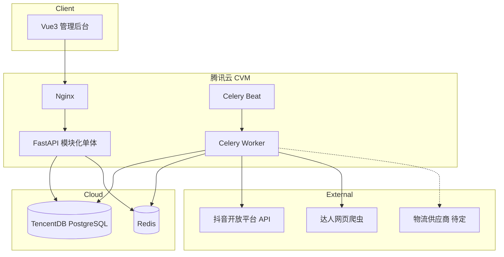
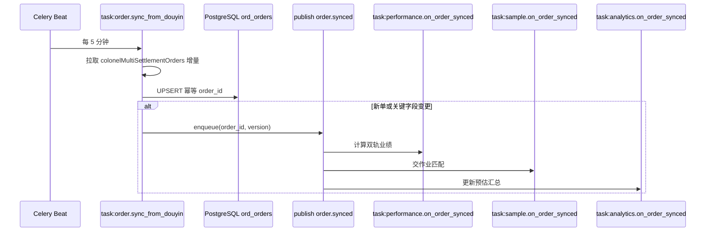

> 本文档已归档，仅作为历史参考；当前口径以 docs/ 下主文档为准。

# 抖音团长 SaaS — 技术落地设计

> **文档性质**：V1 开发的工程实施纲领（架构、模块、数据、部署、非功能需求）  
> **优先级**：[`V1交付范围表.md`](./V1交付范围表.md) > `领域设计/*` + [`设计骨架.md`](./设计骨架.md) > [`saas系统V2.2(定稿).md`](./saas系统V2.2(定稿).md)（仅参考）  
> **版本**：V1.0  
> **日期**：2026-05-17  
> **状态**：已定稿，可进入仓库初始化与波 1 开发

---

## 一、背景与目标

### 1.1 业务画像

| 维度 | 说明 |
|------|------|
| 主体 | 抖音团长（自用型 API 已申请） |
| 外部数据 | 订单、结算、活动/商品 — **抖音开放平台 API** |
| 内部数据 | 达人 CRM、寄样、转链 pick_source、组织与规则配置 — **系统自建** |
| 现网规模 | 约 **1 万单/天**、寄样约 **300/天**、达人累积增长 |
| 设计规模 | **5 万单/天**；内部用户 **20 → 50+** |
| 使用方式 | 公司内部；**页面简约**；**操作流畅**优先于视觉 |

### 1.2 V1 范围（功能合同）

功能验收以 [`V1交付范围表.md`](./V1交付范围表.md) 中 **「V1 确认」列** 为准。技术设计与之对齐的核心裁剪：

| 项 | V1 实现 |
|----|---------|
| 三条业务链 | 渠道 / 招商 / 管理（见范围表 §零） |
| 独家达人/商家 | **不做**；`final_channel = default_channel`，`final_recruiter = default_recruiter` |
| 个别品负责人（P-08/O-04） | **不做**；默认招商 = **活动绑定招商** |
| 毛利指标（Y-04） | **不做** |
| 商品负责人变更重算（Y-05） | **不做** |
| 寄样 30 天自动关闭（S-06） | **不做**；运营 **拒绝** 关单 |
| 一人多角色（U-09） | **做**：权限 **并集**，数据范围 **取最宽** |

### 1.3 工程目标

1. **全新从零**：单仓 monorepo，模块化单体，便于持续迭代。  
2. **5 分钟订单同步**，下游业绩/寄样/汇总允许 **秒级延迟**。  
3. **腾讯云** 部署：dev + prod；密钥不入库。  
4. 为 V2（独家、物流供应商、看板增强）预留 **适配器与功能开关**，V1 不启用。

---

## 二、非功能需求

### 2.1 可演进性（跟随业务变化）

| 原则 | 落地做法 |
|------|----------|
| 边界稳定 | 7 业务域 + 分析模块目录固定；跨域 **不写他域表** |
| 规则外置 | 天数、提成、门槛、模板 → **配置域** + Redis 缓存 |
| 集成隔离 | 抖音 / 爬虫 / 物流 → `integration/` 适配器 |
| 功能开关 | 环境变量或 `sys_feature_flags`：`exclusive_enabled=false` 等 |
| 事件名稳定 | Celery 任务名与领域事件对齐（如 `order.synced`），换实现不换名 |
| 库表演进 | Alembic 向前迁移；新字段可 nullable；订单按月分区 |

**不采用**：微服务、Kafka（当前规模不需要）。

### 2.2 流畅性（内部 50 人）

| 指标 | 目标 |
|------|------|
| 列表 API（有分页+时间范围+索引） | P95 &lt; **500ms** |
| 看板卡片 | 读 **汇总表**，不扫全量订单 |
| 订单同步后衍生数据 | **&lt; 30s** 可见（Celery 异步） |
| 前端 | 路由懒加载；表格 **分页**（默认 20，最大 100）；筛选防抖 300ms |

**产品约束**：列表默认 **近 30 天**；禁止无时间范围全表查询。

### 2.3 UI

- **Vue 3 + Naive UI 默认主题**，无定制 Design System。  
- 统一布局：左侧菜单 + 筛选区 + 表格 + 分页。  
- 看板 V1 可简化（趋势/排行「简化」），后期优化。

---

## 三、技术栈

| 层级 | 选型 | 版本建议 |
|------|------|----------|
| 语言 | Python | 3.12+ |
| Web | FastAPI | 0.115+ |
| ORM | SQLAlchemy | 2.x |
| 迁移 | Alembic | 1.13+ |
| 任务队列 | Celery + Redis | Celery 5.3+ |
| 数据库 | PostgreSQL | 15+（腾讯云 TencentDB） |
| 缓存/队列 | Redis | 7.x（云 Redis） |
| 前端 | Vue 3 + Vite + Pinia | Vue 3.4+ |
| UI | Naive UI | 2.x |
| 部署 | Docker Compose on CVM | Nginx 反代 |
| 抖音 | Python SDK | 见 `重要/抖音开放平台Python_SDK接口文档.md` |

**不选用 Go/Java 的原因**：SDK、爬虫、Excel 均为 Python 生态；20–50 用户下单量下 FastAPI 足够。

---

## 四、总体架构

### 4.1 逻辑架构



### 4.2 模块化单体

- **一个可部署单元**：FastAPI + Celery Worker + Beat（同镜像，不同 command）。  
- **代码按域分包**：每域含 `router` / `service` / `repository` / `models`，仅访问本域表。  
- **跨域协作**：
  - **写副作用**：订单入库后 → Celery 任务（业绩、寄样交作业、分析汇总）。  
  - **读聚合**：BFF 层同步调用各域 **Query API**（如订单列表批量补业绩 Y-08）。  
  - **配置读取**：`ConfigQueryService.get(key)`，带 Redis 缓存。

### 4.3 与领域设计文档关系

| 领域设计 | 技术落地 |
|----------|----------|
| 事件名、状态机、字段语义 | **保持一致**（便于沟通） |
| 独家、个别品负责人、毛利 | V1 **不实现**（见 §1.2） |
| 表名 | 可按下表 `prd_`/`ord_` 等前缀实现，与文档逻辑字段 1:1 |

---

## 五、仓库与模块结构

### 5.1 Monorepo 目录

```text
douyin-colonel-saas/
├── backend/
│   ├── app/
│   │   ├── main.py                 # FastAPI 入口
│   │   ├── api/                    # BFF、健康检查
│   │   │   └── v1/
│   │   ├── domains/
│   │   │   ├── product/            # 商品域
│   │   │   ├── talent/             # 达人域
│   │   │   ├── sample/             # 寄样域
│   │   │   ├── order/              # 订单域
│   │   │   ├── performance/        # 业绩域
│   │   │   ├── user/               # 用户域
│   │   │   └── config/             # 配置域
│   │   ├── analytics/              # 分析模块
│   │   ├── integration/
│   │   │   ├── douyin/             # SDK 封装、Token
│   │   │   ├── crawler/            # 达人爬虫
│   │   │   └── logistics/          # 物流适配器（V1 Manual + 预留 API）
│   │   └── shared/
│   │       ├── db.py
│   │       ├── auth.py
│   │       ├── events.py           # 任务发布封装
│   │       └── idempotency.py
│   ├── workers/
│   │   ├── celery_app.py
│   │   └── tasks/                  # 按域或按任务类型
│   ├── alembic/
│   ├── tests/
│   └── pyproject.toml
├── frontend/
│   ├── src/
│   │   ├── views/                  # 按业务模块
│   │   ├── api/
│   │   ├── stores/                 # Pinia：user、permissions
│   │   └── router/
│   └── package.json
├── deploy/
│   ├── docker-compose.yml          # dev
│   ├── docker-compose.prod.yml
│   └── nginx.conf
├── docs/                           # 可选：链到 typora 设计文档
└── README.md
```

### 5.2 单域内部结构（约定）

```text
domains/order/
├── router.py          # HTTP 路由
├── schemas.py         # Pydantic 入参/出参
├── service.py         # 业务编排
├── repository.py      # 仅本域 SQL
├── models.py          # SQLAlchemy ORM
├── query.py           # 对外只读 Query（供 BFF/他域）
└── tasks.py           # Celery 任务定义
```

**禁止**：`domains/order/repository.py` 里 `UPDATE smp_sample`。

---

## 六、异步事件与 Celery

### 6.1 设计选择

| 方案 | V1 |
|------|-----|
| 进程内 EventBus | 不用（重启丢消息） |
| Kafka/RabbitMQ | 不用（过重） |
| **Celery + Redis** | **采用** |

领域「事件」在实现上映射为 **具名 Celery 任务** + **幂等表** `sys_processed_events`。

### 6.2 订单同步主链路



### 6.3 任务清单（V1 核心）

| 任务名 | 调度 | 说明 |
|--------|------|------|
| `order.sync_from_douyin` | */5 * * * * | 增量同步；记录 `sync_job_runs` |
| `performance.on_order_synced` | 队列消费 | 双轨提成；发 `performance.calculated` |
| `sample.on_order_synced` | 队列消费 | 交作业（§7.3） |
| `analytics.on_order_synced` | 队列消费 | 写 `agg_daily_performance_create` |
| `analytics.on_performance_calculated` | 队列消费 | 写 `agg_daily_performance_settle` |
| `talent.refresh_claimed` | 每日 | 仅刷新**已认领**达人 |
| `talent.refresh_public_slow` | 每周 | 公海慢更新 |
| `product.sync_activity` | 手动触发 | 招商组长同步活动 |
| `product.sync_listing_detail` | 每日 | P-12 商品详情 |
| `config.cache_warm` | 启动/变更后 | 配置刷入 Redis |

### 6.4 幂等与重试

```sql
-- 全局去重（所有消费者共用）
CREATE TABLE sys_processed_events (
    event_id     VARCHAR(128) PRIMARY KEY,  -- 如 order.synced:{order_id}:{content_hash}
    handler      VARCHAR(64)  NOT NULL,
    processed_at TIMESTAMPTZ  NOT NULL DEFAULT now()
);
```

| 规则 | 说明 |
|------|------|
| `event_id` | `order.synced:{order_id}:{status}:{pay_time}:{settle_time}`（关键字段变更加新版本） |
| Celery 重试 | 最多 3 次，指数退避 |
| 失败告警 | `sync_job_runs` 连续失败 / 超 15 分钟无成功 → 企业微信 Webhook（V1 最低监控） |

### 6.5 领域事件映射表（V1 启用）

| 领域事件 | Celery 任务 / 订阅方 |
|----------|----------------------|
| 订单已同步 | `performance.on_order_synced`, `sample.on_order_synced`, `analytics.on_order_synced` |
| 业绩已计算 | `analytics.on_performance_calculated` |
| 寄样已提交/已通过/已完成 | `analytics.on_sample_*` |
| 商品已上架/已隐藏 | `analytics.on_product_*` |
| 配置已变更 | `config.invalidate_cache` + 各域按需重载 |
| 独家* | **V1 不注册消费者** |

---

## 七、核心业务规则（技术定稿）

### 7.1 订单同步

| 项 | 定稿 |
|----|------|
| 接口 | `buyin.colonelMultiSettlementOrders` |
| 频率 | **每 5 分钟** |
| 入库 | `UPSERT` on `order_id`；保留 `raw_payload` JSONB（O-09 联调） |
| 双轨金额 | `estimate_*` / `effective_*` 原样落库（见订单域 §2.4） |
| 默认渠道 | `pick_source` → `ord_pick_source_mapping` → `default_channel_id` |
| 默认招商 | 活动表 `default_recruiter_id`（**无个别品覆盖**） |

### 7.2 业绩计算（V1）

```
服务费收益_预估 = estimate_service_fee - estimate_tech_service_fee
服务费收益_结算 = effective_service_fee - effective_tech_service_fee

渠道提成 = 服务费收益 × 渠道提成比例（配置域）
招商提成 = 服务费收益 × 招商提成比例

final_channel_id  = default_channel_id
final_recruiter_id = default_recruiter_id
```

- **不算毛利**（Y-04=否）。  
- 退款/失效：`is_valid=false`，汇总冲正（Y-06）。  
- 提成比例变更：**仅影响之后同步的新单/重算单**；Y-09 简化版支持单笔重算。

### 7.3 寄样交作业（S-05）

| 项 | 定稿 |
|----|------|
| 匹配维度 | `pick_source` → 渠道 + `talent_id` + `product_id` |
| 付款条件 | **`pay_time IS NOT NULL`**（联调后可用抖音状态字段辅助校验） |
| 目标状态 | 待交作业 → **已完成** |
| 7 天重复限制（S-02） | 维度：**达人 + 商品**（不含渠道） |
| 关单 | **拒绝** → 已拒绝；**不做** 30 天自动关闭（S-06=否） |
| 物流 | 手动录单号（S-08）；S-09/S-10 走 `LogisticsProvider` 接口，供应商后接 |

```python
# 交作业伪代码（sample.on_order_synced）
if order.pay_time is None:
    return
candidates = repo.find_pending_homework(
    channel_id=order.default_channel_id,
    talent_id=order.talent_id,
    product_id=order.product_id,
)
for s in candidates:
    transition(s, "completed", homework_at=order.pay_time)
```

### 7.4 达人更新策略

| 队列 | 对象 | 频率 |
|------|------|------|
| 高 | 当前用户认领的达人 | 手动按钮 + 每日任务 |
| 低 | 公海达人 | 每周 / 手动 |

### 7.5 用户与权限（U-09）

| 项 | 定稿 |
|----|------|
| 认证 | JWT Access + Refresh |
| 多角色 | `user_roles` 多对多；登录后加载全部角色 |
| 操作权限 | 各角色 `permissions` **并集** |
| 数据范围 | `self` &lt; `group` &lt; `all`，取 **最宽**；`group` 时合并所有组的 `user_ids` |
| 实现 | `AuthContext` 注入 FastAPI Depends；各域 Repository 接收 `scope_filter` |

```python
def resolve_data_scope(role_scopes: list[str]) -> str:
    if "all" in role_scopes:
        return "all"
    if "group" in role_scopes:
        return "group"
    return "self"
```

---

## 八、数据架构

### 8.1 库与 Schema

- **单实例 PostgreSQL**，建议单 schema `public`，表名 **域前缀** 区分。  
- 分析汇总表可放 `analytics` schema（可选）。

### 8.2 核心表（按域）

| 域 | 核心表 | 说明 |
|----|--------|------|
| 用户 | `usr_users`, `usr_roles`, `usr_user_roles`, `usr_departments`, `usr_groups` | 多角色 |
| 配置 | `cfg_settings`, `cfg_setting_history` | key-value + JSON |
| 商品 | `prd_activities`, `prd_products`, `prd_activity_products`, `prd_partners`, `prd_pick_source_mappings` | 转链映射 |
| 达人 | `tal_talents`, `tal_claims`, `tal_addresses`, `tal_tags` | 认领不互斥 |
| 寄样 | `smp_samples`, `smp_sample_logs` | 状态机 |
| 订单 | `ord_orders`（**按月分区**）, `ord_pick_source_mappings`, `ord_sync_job_runs` | `raw_payload` JSONB |
| 业绩 | `perf_order_performance` | 双轨金额+提成；`final_*` |
| 分析 | `agg_daily_performance_settle`, `agg_daily_performance_create`, `agg_daily_samples` | 见分析模块文档 |
| 系统 | `sys_processed_events`, `sys_feature_flags` | 幂等、开关 |

### 8.3 订单表分区

```sql
CREATE TABLE ord_orders (
    order_id UUID NOT NULL,
    pay_time TIMESTAMPTZ,
    settle_time TIMESTAMPTZ,
    -- ... 业务字段见订单域 §2.4
    raw_payload JSONB,
    created_at TIMESTAMPTZ NOT NULL DEFAULT now(),
    updated_at TIMESTAMPTZ NOT NULL DEFAULT now(),
    PRIMARY KEY (order_id, pay_time)
) PARTITION BY RANGE (pay_time);

-- 每月一分区；定时任务创建下月分区
```

**索引（示例）**：`(pay_time)`, `(settle_time)`, `(default_channel_id, pay_time)`, `(default_recruiter_id, settle_time)`, `(talent_id, product_id)`, `(pick_source)`.

### 8.4 量级估算

| 项 | 值 |
|----|-----|
| 5 万单/天 × 365 | ~1800 万行/年 |
| 分区 | 按月，查询必带时间范围 |
| 读副本 | V1 **不需要** |

### 8.5 缓存

| Key 模式 | 内容 | TTL |
|----------|------|-----|
| `cfg:{key}` | 系统配置 | 5min，变更主动失效 |
| `auth:perms:{user_id}` | 合并后权限 | 与 token 同寿命或 15min |
| 看板卡片（可选） | `agg:card:{date}:{scope}` | 60s |

---

## 九、API 分层

### 9.1 对外 REST

- 前缀：`/api/v1/`  
- 按域挂载：`/api/v1/products`, `/samples`, `/orders`, `/performance`, `/talents`, `/users`, `/config`, `/dashboard`  
- 统一响应：`{ code, message, data }`  
- 鉴权：`Authorization: Bearer <access_token>`

### 9.2 BFF 聚合（读）

| 接口 | 聚合 |
|------|------|
| `GET /api/v1/orders` | 订单域分页 + `performance.batch_by_order_ids`（Y-08） |
| `GET /api/v1/dashboard/cards` | 分析模块汇总（A-01） |

### 9.3 内部 Query（模块间只读）

```python
# 示例：寄样域调达人域
class TalentQuery(Protocol):
    def get_address_for_claim(self, talent_id: UUID, user_id: UUID) -> AddressDTO: ...
```

实现类注册在 `shared/registry.py`，禁止他域 import `repository`。

---

## 十、外部集成

### 10.1 抖音开放平台

| 项 | 说明 |
|----|------|
| 凭证 | `DOUYIN_APP_KEY`, `DOUYIN_APP_SECRET`；Token 自动刷新 |
| 封装 | `integration/douyin/client.py` |
| 首 sync | 落库 1 条 `raw_payload`，对照 SDK §9.4 校正字段名（O-09） |
| 限流 | 指数退避；失败写 `ord_sync_job_runs` |

### 10.2 达人爬虫

| 项 | V1 |
|----|-----|
| 实现 | `requests` + 单 Cookie（环境变量 `CRAWLER_COOKIE`） |
| 池/代理 | 不做（T-10=否） |

### 10.3 物流（适配器）

```python
class LogisticsProvider(Protocol):
    def track(self, carrier: str, tracking_no: str) -> TrackingStatus: ...
    def batch_import(self, rows: list[ImportRow]) -> ImportResult: ...

class ManualLogisticsProvider(LogisticsProvider): ...
class Kuaidi100Provider(LogisticsProvider): ...  # 供应商确定后实现
```

- V1 默认 `LOGISTICS_PROVIDER=manual`；S-09/S-10 确认做时切换实现。

---

## 十一、前端约定

| 项 | 约定 |
|----|------|
| 路由 | 按模块懒加载：`/talents`, `/products`, `/samples`, `/orders`, `/dashboard`, `/settings` |
| 权限 | 登录后 `GET /auth/me` 返回合并 `permissions`、`data_scope` |
| 列表 | 默认分页 20；日期默认近 30 天 |
| 组件 | Naive UI 默认主题；统一 Loading / Empty / Error |
| 状态 | Pinia 存用户与权限；减少重复请求 |

---

## 十二、部署与环境

### 12.1 环境

| 环境 | 用途 | 部署 |
|------|------|------|
| **dev** | 本机开发 | Docker Compose：PG + Redis + API + Worker |
| **prod** | 生产 | 腾讯云 CVM + TencentDB + 云 Redis |

staging 暂不强制；需要预发布时复制 prod 配置即可。

### 12.2 生产拓扑（推荐起步）

| 组件 | 规格建议 |
|------|----------|
| CVM | 4C8G；Docker Compose：nginx + api + worker×2 + beat |
| TencentDB PostgreSQL | 2C4G 起，自动备份 |
| Redis | 1G 标准版 |
| 静态资源 | Nginx 托管 `frontend/dist` |

### 12.3 配置与密钥

| 类型 | 方式 |
|------|------|
| 密钥 | 环境变量 / 腾讯云 SSM；**禁止**提交 `.env` |
| 示例 | 仓库仅 `.env.example` |
| 功能开关 | `EXCLUSIVE_ENABLED=false`, `LOGISTICS_PROVIDER=manual` |

### 12.4 日志与告警（V1 最低）

| 项 | 做法 |
|----|------|
| 应用日志 | JSON 行；按天滚动 |
| 访问日志 | Nginx |
| 订单同步失败 | `sync_job_runs` + 定时检查 → **企业微信 Webhook** |
| APM/CLS | 暂不强制；有痛点再接腾讯云 |

---

## 十三、安全

| 项 | 说明 |
|----|------|
| 网络 | 后台 HTTPS；DB/Redis 仅内网 |
| 认证 | JWT；密码 bcrypt |
| 授权 | RBAC + 数据范围过滤（所有列表 SQL 必经 scope） |
| 审计 | U-08 简化：至少记录登录（波 2 可扩展操作日志） |
| 多租户 | V1 **单机构**（单团长）；`colonel_id` 字段预留 |

---

## 十四、实现波次（对齐范围表 §十四）

### 波 1 — 渠道链 MVP

**后端**：用户/配置/达人/商品（选品+转链）/寄样申请与审核基础/订单同步与双轨/业绩默认归因/BFF 订单列表/分析卡片基础。  
**前端**：登录、达人、商品库、寄样申请、订单列表、简易看板。  
**运维**：dev Compose、prod 首部署、订单 sync 告警。

### 波 2 — 招商链 + 完善

活动同步、上架审核、寄样台导出、订单状态更新、配置寄样限制、看板趋势/排行简化、用户管理、操作日志简化。

### 波 3 — 增强与 V2 准备

达人批量导入、物流 API/Excel、商品详情定时同步、单笔重算增强、**独家机制（§十七）**。

---

## 十五、P0 验收（技术可测）

| ID | 验收项 | 技术验证点 |
|----|--------|------------|
| P0-1 | 渠道链 E2E | pick_source 映射 → 订单 `default_channel_id` → 业绩 `final` 一致 → 寄样完成 |
| P0-2 | 招商链 E2E | 活动同步 → 上架 → 审寄样 → 订单 `default_recruiter_id` = 活动招商 |
| P0-3 | 管理链 | 改配置后 Redis 失效；新单提成/7 天限制/保护期生效 |
| P0-4 | 转链归因 | `prd_pick_source_mappings` 与订单一致 |
| P0-5 | ~~个别品招商~~ | **V1 跳过**（P-08/O-04=否） |
| P0-6 | 交作业 | `pay_time` 非空后 Celery 将匹配寄样置已完成 |
| P0-7 | 双轨提成 | `perf_order_performance` 预估/结算两套与抽样手算一致 |
| P0-8 | 7 天限制 | DB 唯一约束或查询：`talent_id + product_id` |
| P0-9 | 数据范围 | 渠道 `self` 仅见自己认领+公海 |

---

## 十六、风险与待办

| 风险 | 缓解 |
|------|------|
| API 字段名与文档不一致 | O-09：首 sync 存 `raw_payload`，对照表校正 |
| 付款字段联调 | 交作业以 `pay_time IS NOT NULL` 为准，必要时加 `flow_point` 白名单 |
| 物流供应商未定 | 适配器 + manual 默认 |
| 范围表 P0-5 与确认列冲突 | 以 **P-08/O-04=否** 为准，不测个别品 |
| U-09 与领域设计 V1.0「一人一角」冲突 | **以范围表与本文档为准** |

---

## 十七、环境变量清单（`.env.example`）

```bash
# App
APP_ENV=dev|prod
SECRET_KEY=
ACCESS_TOKEN_EXPIRE_MINUTES=120

# DB / Redis
DATABASE_URL=postgresql+asyncpg://...
REDIS_URL=redis://...

# Douyin
DOUYIN_APP_KEY=
DOUYIN_APP_SECRET=

# Crawler
CRAWLER_COOKIE=

# Logistics
LOGISTICS_PROVIDER=manual
# KUAIDI100_KEY=

# Feature flags
EXCLUSIVE_ENABLED=false

# Alert
WECHAT_WEBHOOK_URL=
```

---

## 十八、文档索引

| 文档 | 用途 |
|------|------|
| [V1交付范围表.md](./V1交付范围表.md) | 功能验收合同 |
| [设计骨架.md](./设计骨架.md) | 领域划分与事件清单 |
| 领域设计/*.md | 业务规则与字段语义 |
| 重要/抖音开放平台Python_SDK接口文档.md | API 与 §9.4 字段映射 |

---

## 十九、版本记录

| 版本 | 日期 | 说明 |
|------|------|------|
| V1.0 | 2026-05-17 | 首版：技术栈、模块化单体、Celery 事件、数据架构、三条链、可演进与流畅性约定；对齐范围表确认列与用户决策（5min 同步、pay_time 交作业、多角色最宽 scope） |

---

**下一步建议**：初始化 monorepo → Alembic 首迁（`ord_orders` 分区 + `sys_processed_events`）→ 实现 `order.sync_from_douyin` 与 O-09 联调 → 波 1 渠道链 E2E。

