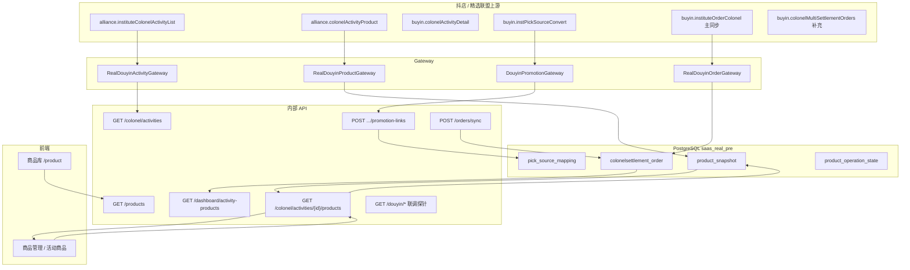

# 19-商品链路本地排查

> 适用环境：`real-pre`（`docker-compose.real-pre.yml`，project `saas-active`）  
> 更新时间：2026-05-21  
> 目标：对照「商品相关上游接口 + 本地封装」做端到端排查，确认字段落库、转链映射、订单 GMV 与看板口径是否一致。  
> 关联文档：[第三方对接总览](../../08-第三方对接总览.md)、[API契约总表](../../05-API契约总表.md)、[real-pre 联调手册](../../验收/real-pre联调手册.md)、[16-数据口径 Open Questions 审计](../audits/16-数据口径OpenQuestions审计.md)、[15-real-pre后续联调执行清单](./15-real-pre后续联调执行清单.md)

---

## 一、排查结论（2026-05-21 本机 real-pre）

| 维度 | 结论 | 说明 |
| --- | --- | --- |
| 环境 | **通过** | `SPRING_PROFILES_ACTIVE=real-pre`，`APP_TEST_ENABLED=false`，`DOUYIN_TEST_ENABLED=false` |
| 活动商品同步 | **通过** | `alliance.colonelActivityProduct` → `product_snapshot` → 业务列表 `refresh=true` |
| 核心字段 | **通过** | `product_id`、`shop_id/shop_name`、`category_name`、`status/status_text`、佣金、销量 |
| 转链 / `pick_source_mapping` | **部分** | 表内有映射，但样本商品无活动级 `v.` 转链；需先「入库」再转链 |
| 订单 / GMV | **有数、未归因** | 335 单，GMV ¥6658.04，归因 0，`pick_source` 订单 0 |
| 看板活动商品 | **空列表** | `GET /dashboard/activity-products` records=0（与订单未挂商品视图一致） |
| 合作方 / 置顶 / 抖店快速寄样 | **未实现** | 见下文「缺口表」 |

**自动化证据**（可复跑）：

- 脚本：`scripts/qa/audit-product-chain-real-pre.ps1`
- 报告目录：`runtime/qa/out/product-chain-audit-20260521-122559/`
- 样本活动：`3920684`；样本商品：`3771167367585988821`

**总体判定**：`WARN`（主同步链路通；转链与归因闭环待补样本操作）

---

## 二、V1 抖店 / 精选联盟接口清单对照（产品口径 × 代码事实）

> 下列「V1 清单」来自产品整理的团长 SaaS V1 对接范围；「本仓库」以 `backend/src/main/java/com/colonel/saas/douyin/api` 与 Gateway 为准（2026-05-21）。

### 2.1 活动与商品同步

| 上游接口 | V1 用途 | 本仓库 | 本地入口 | V1 状态 |
| --- | --- | --- | --- | --- |
| `alliance.instituteColonelActivityList` | 机构下团长活动列表 | `ActivityApi` / `ProductApi.listActivities` | `GET /api/colonel/activities`；联调 `GET /api/douyin/activities` | **已接** |
| `buyin.colonelActivityDetail` | 活动详情、状态兜底 | `DouyinActivityGateway` | `GET /api/douyin/activities/{id}` | **已接** |
| `alliance.colonelActivityProduct` | 活动商品列表入库 | `ProductApi` → `RealDouyinProductGateway` | `GET /api/colonel/activities/{id}/products?refresh=true` | **已接** |
| `buyin.activityProductList` | 一级团长提报商品（P2） | 无 | — | **未接**（V1 不强制，符合清单） |

### 2.2 商品域（库 / 合作方 / 操作）

| 能力 / 上游 | V1 用途 | 本仓库 | 本地入口 | V1 状态 |
| --- | --- | --- | --- | --- |
| 商品库查询 | 多维筛选列表 | `ProductService.getSelectedLibraryPage` | `GET /api/products`（`keyword`、`status`） | **部分**（其余维度前端客户端过滤） |
| `get_partner_products` | 合作方下商品 | 无 | — | **未接**（用 `shop_name` / `shop_id` 代替） |
| `get_product_promotion_copy` | 复制讲解 | 审核补充 + 转链拼接 | 商品详情 / `promotion-links` 结果 | **无独立上游封装** |
| `quick_sample_apply` | 快速寄样 | `SampleController` | `POST /api/samples` | **本地寄样域** |
| `pin_product` / `unpin_product` / `get_pinned_products` | 置顶排序 | 无 | — | **未接** |
| `BuyinProductsDetailRequest` / 商品详情 | 按需同步价格佣金 | 活动商品快照 + `buyin.productSkus.v2` 探针 | SKU 联调、快照 `raw_payload` | **部分**（非独立详情定时任务） |

### 2.3 推广 / 归因

| 上游接口 | V1 用途 | 本仓库 | 本地入口 | V1 状态 |
| --- | --- | --- | --- | --- |
| `buyin.instPickSourceConvert` | 转链 + pick_source | `PromotionApi` | `POST .../promotion-links` → `pick_source_mapping` | **已接**（需已入库） |

### 2.4 订单 / GMV / 业绩

| 上游接口 | V1 用途 | 本仓库 | 本地入口 | V1 状态 |
| --- | --- | --- | --- | --- |
| `buyin.instituteOrderColonel` | **主订单同步** | `OrderApi` → `OrderSyncService` | `POST /api/orders/sync` | **已接**（GMV 主来源） |
| `buyin.colonelMultiSettlementOrders` | 结算单 / 补样本 | `OrderApi` | 联调 `GET /api/douyin/order-settlements` | **已接探针**，不替代主同步 |
| `OrderBatchSensitiveRequest` | 订单敏感字段解密 | 无（历史能力已移除） | — | **不在 V2.2 范围** |
| `list_performance` | 商品维度业绩汇总 | 无独立上游 | `GET /api/dashboard/activity-products` 等为本地聚合 | **部分**（本地 SQL 聚合，非上游 list_performance） |

### 2.5 其他

| 上游 / 能力 | V1 用途 | 本仓库 | V1 状态 |
| --- | --- | --- | --- |
| `list_partners` / `get_partner_detail` | 合作方 | 无 | **未接** |
| `buyin.getProductShareMaterial` | 分享素材 | `PromotionApi` fallback 探针 | **上游已下线** |
| `buyin.productSkus.v2` | SKU 结构 | `ProductApi.getProductSkusV2` | **已接探针** |

**GMV 口径说明（排查必看）**：当前库内 GMV 来自 `colonelsettlement_order`（主同步 `buyin.instituteOrderColonel` 落库），不是仅依赖 `buyin.colonelMultiSettlementOrders`。多结算接口用于结算样本与 Webhook 定向同步补充，见 [测试验收总览](../../09-测试验收总览.md) 与 [16-数据口径审计](../audits/16-数据口径OpenQuestions审计.md)。

---

## 三、上游接口与本地实现对照（排查快照 2026-05-21）

| 上游 / 能力 | 本仓库实现 | 本地 API / 入口 | 排查状态（2026-05-21） |
| --- | --- | --- | --- |
| `alliance.instituteColonelActivityList` | `ActivityApi` | `GET /api/colonel/activities` | **通过** |
| `alliance.colonelActivityProduct` | `ProductApi` → `RealDouyinProductGateway` → `ProductService` | `GET /api/colonel/activities/{id}/products?refresh=true`；联调 `GET /api/douyin/activity-product-list` | **通过** |
| `buyin.colonelActivityDetail` | `DouyinActivityGateway` | 活动详情 / `GET /api/douyin/activities/{id}` | **通过**（活动域） |
| `buyin.instPickSourceConvert` | `PromotionApi` / `DouyinPromotionGateway` | `POST /api/colonel/activities/{aid}/products/{pid}/promotion-links` | **部分**（需商品已入库） |
| `buyin.colonelMultiSettlementOrders` | `OrderApi` | 联调 `GET /api/douyin/colonel-multi-settlement-orders` | 补充样本，**不替代主同步** |
| `buyin.instituteOrderColonel` | `OrderSyncService` | `POST /api/orders/sync` | **主订单同步** |
| `buyin.getProductShareMaterial` | `PromotionApi` fallback | `POST /api/douyin/promotion-link-probes/raw` | 上游已下线，仅探针 |
| 商品库多维查询（文档口径） | `ProductService.getSelectedLibraryPage` | `GET /api/products?page&size&keyword&status` | **部分**（无 partner/tags/sort 服务端参数） |
| `list_partners` / `get_partner_*` | 无 | — | **未实现** |
| `get_product_promotion_copy` | 审核补充 / 转链结果拼接 | 商品详情 `auditSupplement`、`promotionMaterialPack` | **无独立 API** |
| `quick_sample_apply` | 寄样域 | `POST /api/samples`、`POST /api/samples/eligibility-check` | **本地域**，非抖店同名接口 |
| `pin_product` / `get_pinned_products` | 无 | — | **未实现** |

店铺 / 合作方：当前用 `product_snapshot.shop_id`、`shop_name`（及业务视图 `merchantName`）代替独立合作方 API。

---

## 四、V1 商品链路 + 接口调用图（全流程）

```mermaid
flowchart TB
  subgraph upstream [抖店 / 精选联盟上游]
    AL["alliance.instituteColonelActivityList"]
    AD["buyin.colonelActivityDetail"]
    AP["alliance.colonelActivityProduct"]
    SKU["buyin.productSkus.v2"]
    IPC["buyin.instPickSourceConvert"]
    IOC["buyin.instituteOrderColonel 主订单"]
    CMS["buyin.colonelMultiSettlementOrders 补充"]
    GSM["buyin.getProductShareMaterial 已下线"]
  end

  subgraph gap [V1 清单未接 / 本地替代]
    PART["list_partners / get_partner_*"]
    PIN["pin_product / get_pinned"]
    PERF["list_performance 上游"]
    QSA["quick_sample_apply 抖店"]
    COPY["get_product_promotion_copy"]
  end

  subgraph gw [Gateway 层]
    RAct["RealDouyinActivityGateway"]
    RPG["RealDouyinProductGateway"]
    RProm["DouyinPromotionGateway"]
    ROrd["RealDouyinOrderGateway"]
  end

  subgraph api [内部 API]
    ACT["GET /colonel/activities"]
    CAP["GET /colonel/activities/{id}/products"]
    PL["POST .../promotion-links"]
    LIB["GET /products"]
    SMP["POST /samples"]
    OSYNC["POST /orders/sync"]
    DASH["GET /dashboard/*"]
  end

  subgraph db [PostgreSQL]
    CA["colonel_activity"]
    PS["product_snapshot"]
    POS["product_operation_state"]
    PSM["pick_source_mapping"]
    ORD["colonelsettlement_order"]
    PROD["product 共享库"]
  end

  subgraph fe [前端 V1]
    F1["活动列表 / 活动商品推进"]
    F2["商品库 /product"]
    F3["渠道复制讲解"]
    F4["订单 / 数据看板"]
  end

  AL --> RAct --> ACT --> CA
  AD --> RAct
  AP --> RPG --> PS
  CAP --> PS
  CAP --> POS
  SKU -.-> CAP
  ACT --> F1
  CAP --> F1
  LIB --> PROD --> F2
  IPC --> RProm --> PL --> PSM
  F3 --> PL
  SMP --> F2
  IOC --> ROrd --> ORD
  OSYNC --> ORD
  CMS -.-> OSYNC
  ORD --> DASH --> F4
  PS --> CAP

  PART -.-> LIB
  PIN -.-> LIB
  COPY -.-> PL
  QSA -.-> SMP
  PERF -.-> DASH
  GSM -.-> PL
```



图例：**实线** = 当前代码主路径；**虚线** = 未接上游或仅探针 / 本地替代。

---

## 五、端到端调用图（排查精简版）



---

## 六、指标与字段口径

| 指标 | 数据来源 | 本地字段 / API | 备注 |
| --- | --- | --- | --- |
| 商品类目 | 上游同步 | `product_snapshot.category_name` → 列表 `categoryName` | 前端可按类目筛选（客户端） |
| 联盟推广状态 | 上游 `status` | `status` + `status_text`（0 待审核、1 推广中…） | 与系统 `bizStatus` 分离 |
| 系统业务状态 | 本地状态机 | `product_operation_state` / 视图 `bizStatus` | 待审核、已分配、已转链等 |
| 近 30 天销量 | 上游 `sales` | `sales` → 视图 `sales30d` | |
| GMV | 订单汇总 | `colonelsettlement_order.order_amount`；看板 `activity-products` | 当前样本商品订单计数为 0 |
| 转链状态 | 本地推广记录 | `promotionLinkStatus`、`promotion.status` | `PENDING` / `LINKED` / `FAILED` |
| 渠道归因 | 转链 + 订单 | `pick_source_mapping`；订单 `pick_source` | 归因优先级见 [16-数据口径审计](../audits/16-数据口径OpenQuestions审计.md) |

`RealDouyinProductGateway` 写入快照时解析的上游字段包括：`product_id`、`shop_id`、`shop_name`、`activity_cos_ratio`、`ad_service_ratio`、`status`、`category_name`、`sales`、`detail_url` 等；完整 raw 在 `raw_payload`。

---

## 七、分步排查步骤

### 0. 前置：确认 real-pre 单活

```powershell
cd D:\Projects\SAAS
docker compose --project-name saas-active ps
# 应看到 backend-real-pre :8081、frontend-real-pre :3001、postgres-real-pre :5433
```

健康检查：

```powershell
Invoke-RestMethod http://localhost:8081/api/actuator/health
```

环境变量（容器内）：

```powershell
docker exec saas-active-backend-real-pre-1 printenv SPRING_PROFILES_ACTIVE APP_TEST_ENABLED DOUYIN_TEST_ENABLED
# 期望：real-pre / false / false
```

### 1. 活动商品同步 → `product_snapshot`

**业务接口（推荐）**：

```http
GET http://localhost:8081/api/colonel/activities/{activityId}/products?count=20&refresh=true
Authorization: Bearer <admin_token>
```

**上游联调对照**：

```http
GET http://localhost:8081/api/douyin/activity-product-list?activityId={activityId}&count=20
```

**SQL 核对**：

```sql
-- 全库快照量
SELECT COUNT(*) FROM product_snapshot WHERE deleted = 0;

-- 指定活动
SELECT COUNT(*) FROM product_snapshot
WHERE deleted = 0 AND activity_id = '{activityId}';

-- 单商品字段
SELECT product_id, shop_id, shop_name, status, status_text, category_name, sales,
       activity_cos_ratio_text, ad_service_ratio, sync_time
FROM product_snapshot
WHERE deleted = 0 AND activity_id = '{activityId}' AND product_id = '{productId}';
```

**2026-05-21 样本核对**（活动 `3920684`，商品 `3771167367585988821`）：

| 字段 | 值 |
| --- | --- |
| shop_name | 神气水牛官方旗舰店 |
| category_name | 食品饮料 |
| status_text | 推广中 |
| activity_cos_ratio_text | 5.00% |
| sales | 4917 |
| bizStatus（业务视图） | PENDING_AUDIT |

### 2. 转链与 `pick_source_mapping`

**接口**：

```http
POST http://localhost:8081/api/colonel/activities/{activityId}/products/{productId}/promotion-links
Content-Type: application/json
Authorization: Bearer <channel_leader_token>

{"scene":"PRODUCT_LIBRARY","externalUniqueId":"local-audit-001"}
```

**业务前置**：商品须已沉淀到商品库（`selectedToLibrary=true`）。未入库时返回 **460**（本机已验证）。

**SQL**：

```sql
SELECT activity_id, product_id, pick_source, source_type, colonel_buyin_id, promotion_link_id
FROM pick_source_mapping
WHERE deleted = 0
ORDER BY update_time DESC NULLS LAST
LIMIT 20;
```

**2026-05-21 现状**：

- 全表 **8** 条，均为 `colonel_native_{colonel_buyin_id}` 种子，`activity_id` / `product_id` **为空**。
- 样本活动+商品 **无** mapping 行。
- 商品 `detailUrl` 可带上游 `pick_source=v.*` 查询参数，但**未**自动写入 mapping 表。

**补证顺序**：招商审核通过 → `POST .../library-entry` → 渠道转链 → 再查 mapping 是否出现 `pick_source LIKE 'v.%'` 且 activity/product 有值。

### 3. 订单同步与 GMV

**主同步**（非多结算接口）：

```http
POST http://localhost:8081/api/orders/sync
Authorization: Bearer <token>
# Body 按 OrderController 时间窗参数（见 05 文档）
```

**订单 / GMV SQL**：

```sql
SELECT
  COUNT(*) AS active_orders,
  COUNT(*) FILTER (WHERE attribution_status = 'ATTRIBUTED') AS attributed,
  COUNT(*) FILTER (WHERE pick_source IS NOT NULL AND pick_source <> '') AS with_pick_source,
  ROUND(COALESCE(SUM(order_amount), 0) / 100.0, 2) AS gmv_yuan
FROM colonelsettlement_order
WHERE deleted = 0;
```

**2026-05-21**：`335` 单，`0` 归因，`0` 带 pick_source，GMV **6658.04** 元。

**看板对照**：

```http
GET http://localhost:8081/api/dashboard/activity-products?page=1&size=10
Authorization: Bearer <channel_leader_token>
```

本轮 `records=0`；样本商品业务视图 `orderCount=0`、`gmv30d=0.00`。

### 4. 推广状态分布（快照）

```sql
SELECT status, status_text, COUNT(*)
FROM product_snapshot
WHERE deleted = 0
GROUP BY status, status_text
ORDER BY COUNT(*) DESC;
```

2026-05-21 全库大致分布：待审核 2186、推广中 1983、申请未通过 622、合作已到期 136、合作已终止 101 等。

### 5. 数据隔离（非 mock 污染）

```powershell
powershell -ExecutionPolicy Bypass -File scripts/qa/check-real-pre-real-data.ps1 `
  -ComposeFile docker-compose.real-pre.yml `
  -BackendService backend-real-pre `
  -PostgresService postgres-real-pre
```

说明：

- `SPRING_PROFILES_ACTIVE` 本机为 **`real-pre`**（非文档旧写的 `real`），以容器实际值为准。
- `product_snapshot` 的 mock 关键字扫描可能误报正常商品标题，需人工看 SQL 样本。

### 6. 一键商品链路审计

```powershell
powershell -ExecutionPolicy Bypass -File scripts/qa/audit-product-chain-real-pre.ps1
# 默认 BaseUrl http://localhost:8081/api
# 输出 runtime/qa/out/product-chain-audit-<timestamp>/
```

---

## 八、前端筛选与 API 边界（2026-05-21）

商品列表已支持（客户端过滤 + 活动列表远程 `productInfo`）：

- 店铺关键词、抖音类目、系统标签、佣金区间、近 30 天销量档、联盟推广状态、转链状态、寄样 / 招商归属 / 推进判断 / 业务状态。

**尚未有后端参数的文档口径**（勿按已接接口排查）：

- `partner_id`、`goods_tags`、`product_tags`、`search_items`、`sort_by`、`pin_product`、`list_partners`。

共享商品库：`GET /api/products` 仅 `page`、`size`、`keyword`、`status`（上架 1 / 下架 0）。

---

## 九、未实现能力（排查时跳过）

| 能力 | 替代 / 说明 |
| --- | --- |
| `list_partners` / `get_partner_detail` / `get_partner_products` | 用 `shop_name`、`shop_id`、独家商家表 |
| `pin_product` / `unpin_product` / `get_pinned_products` | 无本地排序置顶 |
| `quick_sample_apply`（抖店） | `POST /api/samples` +  eligibility |
| 商品库多维服务端筛选 | 前端 `product-filters.ts` 客户端过滤已加载页 |

---

## 十、后续补证清单（闭环 sample）

按优先级：

1. **入库 + 转链**：`biz_leader` 审核 / 入库 → `channel_leader` 调 `promotion-links` → 确认 `pick_source_mapping` 含 `v.` + activity/product。
2. **订单归因**：同步窗口内出现带 `pick_source` 或可对上 `colonel_buyin_id` 的订单 → `POST /orders/sync` → 归因计数 > 0。
3. **看板**：`dashboard/activity-products` 与 PostgreSQL 订单按活动+商品聚合对账（可参考 `scripts/qa/run-real-pre-dashboard-reconcile.ps1`）。
4. **多结算补充**：`watch-real-pre-order-settlements.ps1` 观察 `colonelMultiSettlementOrders` 样本（不替代主同步结论）。

---

## 十一、相关脚本与报告索引

| 用途 | 路径 |
| --- | --- |
| 商品链路审计 | `scripts/qa/audit-product-chain-real-pre.ps1` |
| **商品订单归因编排（推荐）** | `scripts/qa/audit-product-order-attribution-real-pre.ps1` → Runbook [20-real-pre商品订单归因逻辑排查](./20-real-pre商品订单归因逻辑排查.md) |
| real-pre 数据隔离 | `scripts/qa/check-real-pre-real-data.ps1` |
| real-pre 主链路回归 | `scripts/qa/run-real-pre-final-regression.ps1` |
| 订单多结算观察 | `scripts/qa/watch-real-pre-order-settlements.ps1` |
| 待补证据观察 | `scripts/qa/watch-real-pre-pending-evidence.ps1` |
| 本轮审计 JSON | `runtime/qa/out/product-chain-audit-20260521-122559/report.json` |
| 活动商品 refresh 响应 | `runtime/qa/out/product-chain-audit-20260521-122559/colonel-products-refresh.json` |

---

## 十二、修订记录

| 日期 | 说明 |
| --- | --- |
| 2026-05-21 | 首版：基于本机 real-pre 实跑 `audit-product-chain-real-pre.ps1` 与 SQL 复核写入 |
| 2026-05-21 | 增补 V1 产品接口清单对照表与全流程 Mermaid 调用图 |
