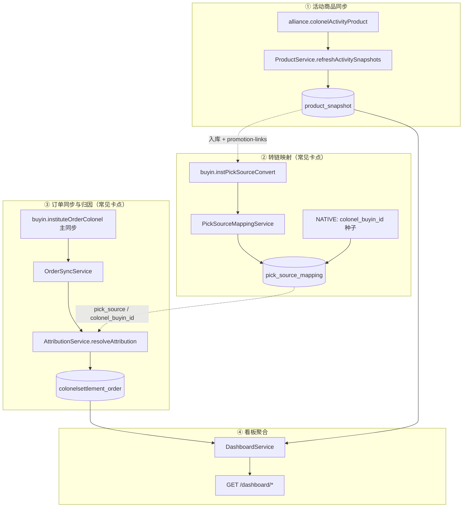

# 20-real-pre 商品订单归因逻辑排查

> **仅使用 real-pre**（`docker-compose.real-pre.yml`，project `saas-active`）  
> 更新时间：2026-05-21  
> 目标：在不依赖生产库的前提下，按「快照 → 转链映射 → 订单归因 → 看板」验证 **逻辑是否正确**，定位卡点。  
> 关联：[第三方对接总览](../../08-第三方对接总览.md)、[部署运行总览](../../10-部署运行总览.md)、[real-pre 联调手册](../../验收/real-pre联调手册.md)、[19-商品链路本地排查](./19-商品链路本地排查.md)、[16-数据口径 Open Questions 审计](../audits/16-数据口径OpenQuestions审计.md)

---

## 一、环境与端口（固定 real-pre）

| 项 | 值 |
| --- | --- |
| 前端 | `http://localhost:3001` |
| 后端 API | `http://localhost:8081/api` |
| PostgreSQL | 宿主机 `5433`，库名 `saas_real_pre`，用户 `saas` |
| Redis | 宿主机 `6380` |
| Profile | `SPRING_PROFILES_ACTIVE=real-pre`（或 `real`） |
| 测试开关 | `APP_TEST_ENABLED=false`，`DOUYIN_TEST_ENABLED=false` |

**禁止**：在同一时段并行拉起 `test`（`3000/8080`）与 real-pre，避免端口/容器混用导致结论不可信。

### 0.1 启动与健康

```powershell
cd D:\Projects\SAAS
powershell -ExecutionPolicy Bypass -File .\scripts\start-real-pre.ps1

docker compose --project-name saas-active ps
Invoke-RestMethod http://localhost:8081/api/actuator/health
```

### 0.2 数据隔离（非 mock 污染）

```powershell
powershell -ExecutionPolicy Bypass -File .\scripts\qa\check-real-pre-real-data.ps1 `
  -ComposeFile docker-compose.real-pre.yml `
  -BackendService backend-real-pre `
  -PostgresService postgres-real-pre
```

### 0.3 登录账号（浏览器 / API）

| 角色 | 账号 | 密码 | 用途 |
| --- | --- | --- | --- |
| 管理员 | `admin` | `admin123` | 活动商品 refresh、订单同步、全量 SQL |
| 渠道组长 | `channel_leader` | `admin123` | 转链、`dashboard/activity-products` DataScope |
| 招商组长 | `biz_leader` | `admin123` | 商品审核入库 |

---

## 二、逻辑链路总览（排查用）



**代码事实（与 V1 设计对齐）**：

- 快照表名是 **`product_snapshot`**（非文档旧称 `ActivityProductSnapshot`）。
- 看板 GMV 来自 **`colonelsettlement_order`** 本地聚合，仓库内无独立 `agg_daily_performance_settle` 表。
- 主订单同步是 **`buyin.instituteOrderColonel`**；`buyin.colonelMultiSettlementOrders` 仅作结算样本 / Webhook 补充，**不替代**主同步结论。

---

## 三、归因优先级（逻辑核对必背）

`AttributionService.resolveAttribution` 顺序：

1. 独家商家 → `ATTRIBUTED`
2. 独家达人 → `ATTRIBUTED`
3. 订单带 `colonel_buyin_id` / `second_colonel_buyin_id` → 查 **`pick_source_mapping.source_type=NATIVE`** → `REASON_COLONEL_ORDER_INFO` 或 `COLONEL_MAPPING_*`
4. 无 `pick_source` 且无 `pick_extra` → `UNATTRIBUTED` / `NO_PICK_SOURCE`
5. 有 `pick_source` → 查 **渠道转链映射** → `ATTRIBUTED` 或 `MAPPING_NOT_FOUND` / `CHANNEL_NOT_FOUND`

排查时按此顺序看 `unattributed_reason`，不要只看 `pick_source` 是否为空。

---

## 四、分步排查（real-pre 可执行）

### 步骤 1：活动商品同步 → `product_snapshot`

| 校验点 | 通过标准 |
| --- | --- |
| 上游可拉 | `GET /douyin/activity-product-list?activityId={id}` 有 data |
| 落库 | `refresh=true` 后 `product_snapshot` 条数 > 0 |
| 核心字段 | `product_id`、`activity_id`、`shop_id/shop_name`、`status/status_text`、`sales`、佣金字段 |
| 推广中 | 联盟 `status=1` 与 `status_text` 推广中一致 |

**API**：

```http
GET http://localhost:8081/api/colonel/activities/{activityId}/products?count=20&refresh=true
Authorization: Bearer <admin_token>
```

**SQL**（容器内，将 `{activityId}` 替换为样本活动 ID）：

```sql
SELECT COUNT(*) FROM product_snapshot WHERE deleted = 0 AND activity_id = '{activityId}';

SELECT product_id, shop_name, status, status_text, category_name, sales, sync_time
FROM product_snapshot
WHERE deleted = 0 AND activity_id = '{activityId}'
ORDER BY sync_time DESC NULLS LAST
LIMIT 5;
```

**逻辑判定**：本步 FAIL 时，后续转链/归因无意义，先修 Token / 活动 ID / 上游限流。

---

### 步骤 2：转链映射 → `pick_source_mapping`

| 校验点 | 通过标准 |
| --- | --- |
| `pick_source` 非空 | 渠道转链行应有 `pick_source`（常 `v.*` 前缀） |
| 维度完整 | 样本行应同时有 **`activity_id` + `product_id`**（非仅 `colonel_native_*` 种子） |
| 与快照对应 | 样本活动+商品在 mapping 表有 `status=1` 行 |
| 业务前置 | 商品已入库（未入库转链可能 **460**） |

**API**（渠道组长 Token）：

```http
POST http://localhost:8081/api/colonel/activities/{activityId}/products/{productId}/promotion-links
Content-Type: application/json
Authorization: Bearer <channel_leader_token>

{"scene":"PRODUCT_LIBRARY","externalUniqueId":"real-pre-audit-001"}
```

**补证顺序（逻辑闭环）**：

1. `biz_leader`：审核通过 → `POST .../library-entry`（商品入库）
2. `channel_leader`：上一步 `promotion-links`
3. SQL 确认 mapping 出现且 `activity_id`/`product_id` 有值

**SQL**：

```sql
-- 全表概况
SELECT COUNT(*) AS total,
       COUNT(*) FILTER (WHERE pick_source IS NOT NULL AND pick_source <> '') AS with_pick,
       COUNT(*) FILTER (WHERE pick_source LIKE 'v.%') AS v_prefix,
       COUNT(*) FILTER (WHERE activity_id IS NOT NULL AND activity_id <> '' AND product_id IS NOT NULL AND product_id <> '') AS with_activity_product
FROM pick_source_mapping WHERE deleted = 0;

-- 样本活动+商品
SELECT activity_id, product_id, pick_source, source_type, colonel_buyin_id, user_id::text, update_time
FROM pick_source_mapping
WHERE deleted = 0 AND activity_id = '{activityId}' AND product_id = '{productId}'
ORDER BY update_time DESC NULLS LAST;

-- 快照有、映射无（缺口 Top20）
SELECT ps.activity_id, ps.product_id, ps.title
FROM product_snapshot ps
LEFT JOIN pick_source_mapping m
  ON m.deleted = 0 AND m.activity_id = ps.activity_id AND m.product_id = ps.product_id AND m.status = 1
WHERE ps.deleted = 0 AND m.id IS NULL
LIMIT 20;
```

**逻辑判定**：

- 仅存在 `colonel_native_{buyinId}` 且 `activity_id` 为空 → **NATIVE 种子有，渠道转链闭环未建立**（2026-05-21 本机常见态）。
- 有 `v.` 映射但订单仍 UNATTRIBUTED → 进入步骤 3 看订单 `pick_source` 是否与映射一致、时间先后。

---

### 步骤 3：订单同步与归因 → `colonelsettlement_order`

| 校验点 | 通过标准 |
| --- | --- |
| 同步成功 | `POST /orders/sync` 无 busy；订单总量随窗口增长 |
| 归因分布 | 存在 `attribution_status='ATTRIBUTED'`（或能解释为何全 UNATTRIBUTED） |
| pick_source 订单 | 有 `pick_source` 的订单应能匹配 mapping（否则 `MAPPING_NOT_FOUND`） |
| NATIVE 订单 | 带 `colonel_buyin_id` 的订单应能匹配 NATIVE 映射 |

**API**：

```http
POST http://localhost:8081/api/orders/sync
Authorization: Bearer <admin_token>
```

（时间窗参数以 `OrderController` / [API契约总表](../../05-API契约总表.md) 为准。）

**SQL**：

```sql
SELECT
  COUNT(*) AS active_orders,
  COUNT(*) FILTER (WHERE attribution_status = 'ATTRIBUTED') AS attributed,
  COUNT(*) FILTER (WHERE attribution_status = 'UNATTRIBUTED') AS unattributed,
  COUNT(*) FILTER (WHERE pick_source IS NOT NULL AND pick_source <> '') AS with_pick_source,
  ROUND(COALESCE(SUM(order_amount), 0) / 100.0, 2) AS gmv_yuan
FROM colonelsettlement_order
WHERE deleted = 0;

SELECT COALESCE(unattributed_reason, '(null)') AS reason, COUNT(*)
FROM colonelsettlement_order
WHERE deleted = 0 AND attribution_status = 'UNATTRIBUTED'
GROUP BY 1
ORDER BY COUNT(*) DESC
LIMIT 15;

-- 带 pick_source 但未归因（逻辑异常样本）
SELECT order_id, pick_source, activity_id, product_id, unattributed_reason, create_time
FROM colonelsettlement_order
WHERE deleted = 0
  AND pick_source IS NOT NULL AND pick_source <> ''
  AND attribution_status = 'UNATTRIBUTED'
ORDER BY create_time DESC
LIMIT 10;
```

**逻辑判定表**：

| 现象 | 可能原因 | 下一步 |
| --- | --- | --- |
| `0` 归因、`0` pick_source 订单 | 上游订单未带推广参数；或同步窗口无新单 | `watch-real-pre-pick-source-orders.ps1` |
| 有 pick_source、全 UNATTRIBUTED | mapping 缺失或 `user_id` 为空 | 步骤 2 SQL 缺口 + mapping 行核对 |
| 有 NATIVE 映射、仍 `COLONEL_MAPPING_NOT_FOUND` | `colonel_buyin_id` 与种子不一致 | 对照订单 `extra_data` 与 mapping |
| 归因 > 0 | 逻辑闭环样本成立 | 步骤 4 看板对账 |

**P3-6 专项证据（推荐）**：

```powershell
powershell -ExecutionPolicy Bypass -File .\scripts\qa\run-real-pre-attribution-evidence.ps1 `
  -BaseUrl http://localhost:8081/api
```

输出：`runtime/qa/out/real-pre-attribution-evidence-<timestamp>/`

---

### 步骤 4：看板与库内聚合一致性

| 校验点 | 通过标准 |
| --- | --- |
| API 有数 | `GET /dashboard/summary`、`/dashboard/activity-products` 与角色 DataScope 一致 |
| 口径一致 | Summary 订单数/GMV 与 PostgreSQL 聚合差异在 reconcile 容忍范围内 |

**API**：

```http
GET http://localhost:8081/api/dashboard/summary
GET http://localhost:8081/api/dashboard/activity-products?page=1&size=10
Authorization: Bearer <channel_leader_token>
```

**对账脚本（real-pre）**：

```powershell
$env:API_BASE_URL = "http://localhost:8081"
$env:QA_DB_NAME = "saas_real_pre"
node runtime/qa/dashboard-reconcile.cjs
```

或：

```powershell
powershell -ExecutionPolicy Bypass -File .\scripts\qa\run-real-pre-dashboard-reconcile.ps1
```

**逻辑判定**：`activity-products` 为空但订单 GMV > 0，通常是订单未挂到「活动+商品」视图维度（`activity_id`/`product_id` 空或与快照不一致），属**展示链路**问题，不一定是同步失败。

---

### 步骤 5：事件与定时触发（辅助）

| 触发 | 作用 | real-pre 排查方式 |
| --- | --- | --- |
| `OrderSyncService.syncLatestWindow` | 增量主同步 | 调 `POST /orders/sync` 后复跑步骤 3 SQL |
| Webhook `order_ids` | 定向多结算补拉 | `watch-real-pre-order-settlements.ps1` |
| 活动 `refresh=true` | 只更新快照 | **不会**自动生成转链映射 |

---

### 步骤 6：前端与 DataScope（逻辑）

| 角色 | 检查项 |
| --- | --- |
| `admin` | 商品/订单列表可见全量；归因 dry-run（`22-v1-admin-config-chain`） |
| `channel_leader` | 仅本渠道 mapping/订单；看板指标与 SQL 过滤一致 |
| 筛选 | 活动列表 `productInfo`、`status=1`（推广中）与 `product_snapshot` 对齐 |

浏览器证据（可选）：

```powershell
npm run e2e:real-pre:business
npm run e2e:real-pre:roles
```

> E2E 10/11/12 **不自动创建**真实转链，只复用已有 mapping；缺映射时会 BLOCK，需先完成步骤 2 人工补证。

---

## 五、一键排查入口（仅 real-pre）

### 5.1 归因链路编排（推荐）

```powershell
cd D:\Projects\SAAS
powershell -ExecutionPolicy Bypass -File .\scripts\qa\audit-product-order-attribution-real-pre.ps1
```

顺序：环境隔离 → 归因 SQL 报告 → 商品链路审计 → P3-6 归因证据（均指向 `8081` / `saas_real_pre`）。

输出目录：`runtime/qa/out/product-order-attribution-audit-<timestamp>/`

### 5.2 分脚本（按需单独跑）

| 步骤 | 脚本 |
| --- | --- |
| 商品快照 + 映射 + 订单概况 | `scripts/qa/audit-product-chain-real-pre.ps1` |
| P3-6 归因样本 | `scripts/qa/run-real-pre-attribution-evidence.ps1 -BaseUrl http://localhost:8081/api` |
| P3-7 看板对账 | `scripts/qa/run-real-pre-dashboard-reconcile.ps1` |
| 主链路回归 | `scripts/qa/run-real-pre-final-regression.ps1` |
| pick_source 订单观察 | `scripts/qa/watch-real-pre-pick-source-orders.ps1` |
| 多结算样本观察 | `scripts/qa/watch-real-pre-order-settlements.ps1` |

---

## 六、结论模板（填表用）

| 阶段 | 结果 PASS / WARN / FAIL | 证据路径 | 备注 |
| --- | --- | --- | --- |
| 0 环境 real-pre 单活 | | `check-real-pre-real-data` | |
| 1 活动商品快照 | | `colonel-products-refresh.json` | |
| 2 转链 mapping | | SQL / `promotion-links` 响应 | |
| 3 订单归因 | | `run-real-pre-attribution-evidence` | |
| 4 看板对账 | | `dashboard-reconcile` diff | |
| 5 前端 DataScope | | E2E 报告（可选） | |

**总体逻辑判定（2026-05-21 基线）**：

- **设计正确**：快照 → 映射 → 归因 → 看板 代码路径齐全。
- **本机 real-pre 卡点**：步骤 2 样本级 `v.` 映射 + 步骤 3 带 `pick_source` 真实订单样本仍不足；步骤 1 与主订单 GMV 已有数。
- **不阻塞**：活动商品字段落库、NATIVE 种子映射、主同步与 Dashboard 库内聚合（P3-7 已通过历史证据）。

---

## 七、与 Runbook 19 的分工

| 文档 | 范围 |
| --- | --- |
| [19-商品链路本地排查](./19-商品链路本地排查.md) | 商品域全接口清单、V1 对照、推广状态、未实现能力 |
| **本文 20** | **仅归因闭环**：映射覆盖率、归因 reason 分布、看板一致性、real-pre 脚本入口 |

---

## 八、修订记录

| 日期 | 说明 |
| --- | --- |
| 2026-05-21 | 首版：real-pre 专用归因逻辑排查 Runbook + 编排脚本 |
