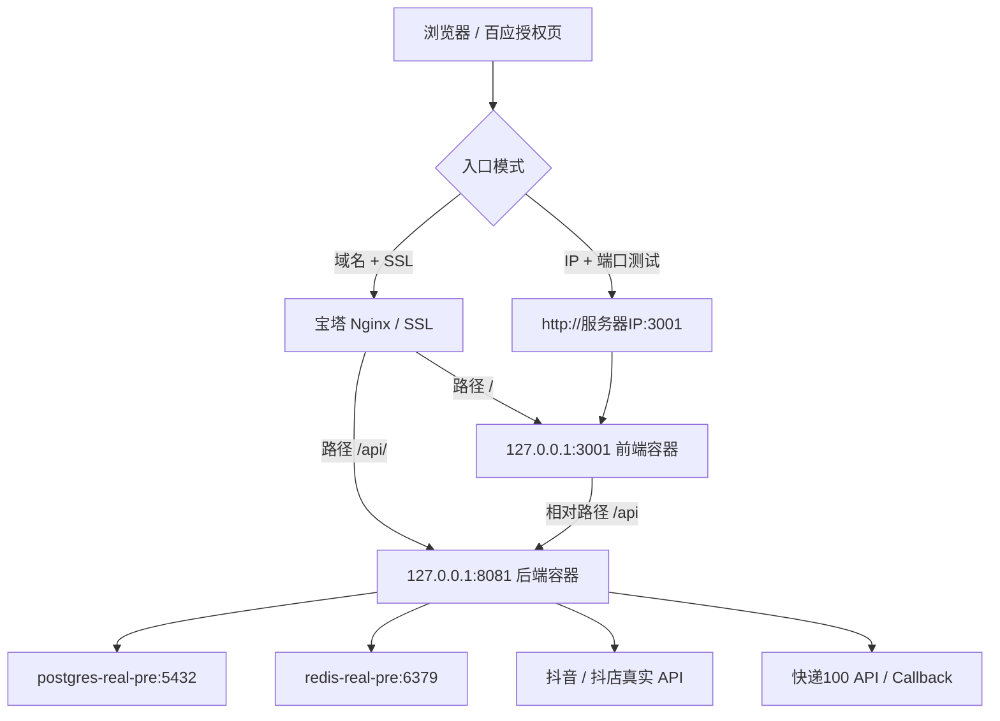

# 服务器部署总览

## 适用场景

本文用于抖音团长 SaaS 的服务器 `real-pre` 受控部署。当前目标是端口测试、Docker 手动部署、抖音 / 百应 Token 授权、真实 API 联调、订单回流、`pick_source` 归因、寄样自动完成和业绩双轨金额验证。

当前不是正式生产全量上线。允许写“服务器 real-pre 受控部署完成”，不允许写“正式生产全量上线”或“real-pre P0 全量通过”，除非后续真实订单样本、归因、寄样和业绩均完成验收。

## 当前仓库实际情况

以当前仓库文件为准：

| 项目 | 当前事实 |
| --- | --- |
| Compose 文件 | `docker-compose.real-pre.yml` |
| Compose project | `saas-active` |
| 环境示例 | `.env.real-pre.example` |
| 服务器 env | `/opt/saas/env/.env.real-pre` |
| PostgreSQL 服务 | `postgres-real-pre`，容器内 `5432`，不对公网开放 |
| Redis 服务 | `redis-real-pre`，容器内 `6379`，不对公网开放 |
| 后端服务 | `backend-real-pre`，容器内 `8080`，宿主默认 `8081` |
| 前端服务 | `frontend-real-pre`，容器内 `80`，宿主默认 `3001` |
| 后端健康检查 | `GET /api/system/health` |
| 前端健康检查 | `GET /healthz` |
| 部署脚本 | `scripts/deploy-real-pre.sh` |
| E2E 门禁 | `npm run e2e:real-pre:p0:preflight`、`npm run e2e:real-pre:roles`、`npm run e2e:real-pre:p0` |

## 前置条件

- 一台可 SSH 登录的 Linux 服务器。
- 已安装 Git、Docker 和 Docker Compose 插件。
- 已准备真实 `.env.real-pre`，并且不提交到 Git。
- 已确认抖音 / 抖店应用凭据：`DOUYIN_APP_ID`、`DOUYIN_CLIENT_KEY`、`DOUYIN_CLIENT_SECRET`。
- 如果做完整百应授权跳转，需准备域名、SSL 和可访问的 HTTPS 回调地址。

## 部署架构



## 职责边界

| 组件 | 职责 | 不负责 |
| --- | --- | --- |
| 宝塔 | 域名、SSL、Nginx 反代、防火墙、面板监控 | 不运行前端构建，不替代 Docker Compose |
| Docker Compose | 运行 PostgreSQL、Redis、后端、前端容器 | 不负责公网域名证书 |
| Jenkins | 第二阶段自动化：拉代码、测试、调用部署脚本、归档证据 | 不参与第一次手动部署，不重新发明部署流程 |

## 两种部署模式

### 模式一：只有服务器 IP 的端口测试

用于第一轮端口和容器连通性验证。

```text
前端：http://服务器IP:3001
后端：http://服务器IP:8081/api/system/health
OAuth 回调可临时用：http://服务器IP:8081/api/douyin/oauth/callback
```

限制：只能做端口级调试；百应授权跳转体验、浏览器 HTTPS 安全策略、正式 callback 域名一致性不能完整验证。

### 模式二：域名 + SSL + 宝塔 Nginx 完整联调

推荐用于百应授权、OAuth code 回调和真实 Token 转换。

```text
前端：https://real-pre.xxx.com
后端 API：https://real-pre.xxx.com/api/system/health
OAuth 回调：https://real-pre.xxx.com/api/douyin/oauth/callback
授权成功页：https://real-pre.xxx.com/system/douyin?oauth=success
```

## 百应授权链路

当前仓库 OAuth 入口：

| 环节 | 当前仓库路径 |
| --- | --- |
| 前端授权页 | `/system/douyin` |
| 获取授权 URL | `GET /api/douyin/oauth/authorize-url` |
| OAuth callback | `GET /api/douyin/oauth/callback` |
| 成功跳转 | `DOUYIN_OAUTH_FRONTEND_SUCCESS_URL` |
| 失败跳转 | `DOUYIN_OAUTH_FRONTEND_FAILURE_URL` |

链路：

```text
管理员打开 /system/douyin
-> 前端请求 /api/douyin/oauth/authorize-url
-> 浏览器跳转百应 / 抖店授权页
-> 百应携带 code/state 回调 /api/douyin/oauth/callback
-> 后端校验 state
-> 后端调用 token.create 换取 access_token / refresh_token
-> 后端保存 token 到 Redis
-> 后端 302 跳回 /system/douyin?oauth=success 或 failed
```

当前仓库实际日志关键字不是固定的 `oauth callback received` / `token.create success`。以代码为准，成功回调可检索 `Douyin OAuth callback handled successfully`，token 创建可检索 `TokenCreateResponse received` 或 `RealDouyinTokenGateway` 相关脱敏日志。

## 执行步骤

1. 阅读 [01-服务器初始化与宝塔配置.md](01-服务器初始化与宝塔配置.md)。
2. 先按 [02-Docker手动部署real-pre.md](02-Docker手动部署real-pre.md) 完成 Docker 端口部署。
3. 如需百应授权，按 [03-域名SSL与宝塔Nginx反向代理.md](03-域名SSL与宝塔Nginx反向代理.md) 补域名和 SSL。
4. 按 [04-百应抖音授权与Token联调.md](04-百应抖音授权与Token联调.md) 完成授权。
5. 按 [05-real-pre部署后验收门禁.md](05-real-pre部署后验收门禁.md) 跑门禁。
6. 失败时按 [06-回滚与故障排查.md](06-回滚与故障排查.md) 定位。
7. 手动流程稳定后，再按 [07-Jenkins自动化部署规划.md](07-Jenkins自动化部署规划.md) 接入 Jenkins。

## 验收标准

- `docker compose ps` 显示四个服务运行。
- `curl http://127.0.0.1:8081/api/system/health` 返回 `{"status":"UP"}`。
- `curl http://127.0.0.1:3001/healthz` 返回 `ok`。
- `APP_TEST_ENABLED=false`。
- `DOUYIN_TEST_ENABLED=false`。
- `DOUYIN_REAL_UPSTREAM_MODE=live`。
- real-pre 上游读、同步、刷新、回调和写入类开关默认开启；真实推广写入保持 `DOUYIN_REAL_PROMOTION_WRITE_ENABLED=true` 且 `ALLOW_REAL_PROMOTION_WRITE=true`。
- 当验收目标包含商品库复制简介携带推广链接、真实 `instPickSourceConvert` 或 `pick_source` 归因取证时，默认按真实上游写入执行并留存请求、响应、数据库和日志证据。
- E2E 门禁至少执行并归档结果。

## 明确禁止

- 不得把 `.env.real-pre` 提交到 Git。
- 不得公网开放 PostgreSQL `5432`。
- 不得公网开放 Redis `6379`。
- 不得只开启单个真实推广写入开关；real-pre 默认 `DOUYIN_REAL_PROMOTION_WRITE_ENABLED=true` 与 `ALLOW_REAL_PROMOTION_WRITE=true` 必须同时成立。若临时关闭，也必须两个开关同时关闭并记录原因、影响范围和恢复计划。
- 不得把 PENDING 写成 P0 PASS。
- 不得把 real-pre 受控部署写成正式生产全量上线。

## 常见问题

| 问题 | 判断方法 | 处理 |
| --- | --- | --- |
| 端口模式能访问，OAuth 失败 | callback 仍是 IP 或 HTTP | 切域名 + HTTPS，并同步百应后台配置 |
| P0 为 PENDING | 缺真实订单或真实成交样本 | 不记为失败，继续采集样本 |
| Nginx 后端 404 | `/api/` 反代路径错误 | 确认代理到 `http://127.0.0.1:8081/api/` |
| Token 失败 | code 过期或配置不一致 | 重新授权，核对 client_key/client_secret/callback |
