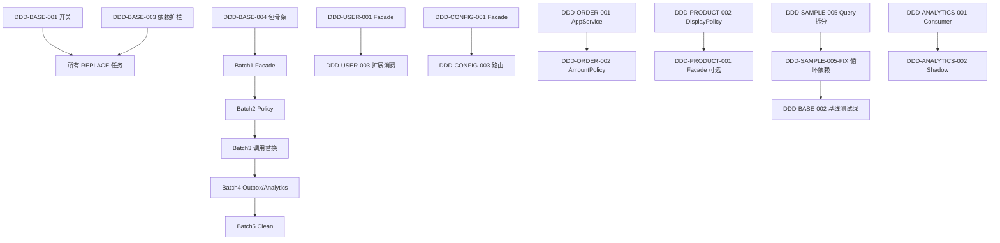

# DDD Task Dependency Graph

## 串行链（Integration 合并顺序）

1. `DDD-SAMPLE-005-FIX`（必须先绿 `ColonelSaasApplicationTests`）
2. `DDD-CONFIG-003-FIX`
3. `DDD-ORDER-002`
4. Facade 并行批次合并：USER-003 / PRODUCT-001 / TALENT-001 / PERF-001
5. Policy 批次：PERF-002 / SAMPLE-006
6. Batch3 调用替换（每次一个方向）
7. Outbox / processed_events migration（Infra 牵头）

## 文件冲突矩阵（高风险）

| 文件 | 可能冲突 Agent |
|------|----------------|
| `OrderSyncService.java` | Order Agent only |
| `SampleController.java` / `LegacySampleQueryService.java` | Sample Agent only |
| `CommissionService.java` / `ProductService.java` | Config + Performance；须串行 |
| `cross-domain-mapper-legacy-whitelist.txt` | Architecture Guard 审批后任一 Agent |
| `DddRefactorProperties.java` | Infra Agent only |
| `application.yml` | Infra Agent only |
