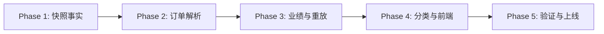

# Role-Aware Promotion Link Attribution Implementation Plan

> **For agentic workers:** REQUIRED SUB-SKILL: Use superpowers:subagent-driven-development (recommended) or superpowers:executing-plans to implement this plan task-by-task. Steps use checkbox (`- [ ]`) syntax for tracking.

**Goal:** 让推广链接创建人的业务角色成为订单归因事实：招商角色创建的链接把业绩归给该招商账号，渠道角色创建的链接只归渠道；活动招商仅作为招商兜底，并支持缺失 `pick_source` 时基于原生业务键做唯一、安全、可审计的归因。

**Architecture:** 转链时固化 `attribution_owner_type` 快照；订单域以同一解析器处理实时同步与历史重放，纯策略分别计算渠道和招商；业绩域只消费订单最终事实。角色纠正、历史映射分类、订单重放彼此独立，均有审计与确认门禁。

**Tech Stack:** Java 17、Spring Boot、MyBatis-Plus、PostgreSQL、JUnit 5、Mockito、Vue 3、TypeScript、Vitest、Docker Compose、PowerShell Harness。

---

## 已验证基线

- 工作树：`D:\Projects\SAAS\.worktrees\role-aware-link-attribution`
- 分支：`codex/role-aware-link-attribution`；基线：`04629dde`。
- 后端 package 已通过；相关后端 51 个测试、前端 6 个测试已通过。
- npm audit 的 6 个既有告警不在本任务自动升级。
- 当前不授权远端部署、线上角色修改、映射 apply 或订单重放 apply。
- 不新增原生键索引：远端 16 条映射，活动+商品查询约 0.022 ms。

## 业务不变量

1. 招商链接所有者 > 活动招商 > 空；商品负责人不再是默认招商。
2. 渠道链接所有者只写渠道，招商链接所有者只写招商。
3. owner type 在转链时快照，重放不按当前角色重新推断。
4. 缺 `pick_source` 时按业务时间筛选；只有唯一 `(user_id, owner_type)` 可采用。
5. 同 owner 多行不歧义；不同 owner/type 必须 `ambiguous`，不得取最新。
6. 业务时间为 `pay_time > order_create_time > create_time`。
7. 来源值仅为 `pick_source`、`native_unique_link_owner`、`activity_owner`、`ambiguous`、`unattributed`。
8. 业绩域透传订单事实，不按活动、商品或当前角色重算。

## 分阶段执行索引

- [ ] **Phase 1：事实字段、角色策略、转链快照**

执行 [01-schema-link.md](2026-07-16-role-aware-promotion-link-attribution-01-schema-link.md)。完成数据库迁移、共享类型、用户角色批量端口、链接 owner type 快照和招商转链权限；按该文件的 RED/GREEN/commit 顺序执行。

- [ ] **Phase 2：唯一映射解析与默认订单归因**

执行 [02-order-resolution.md](2026-07-16-role-aware-promotion-link-attribution-02-order-resolution.md)。完成业务时间、原生键唯一解析、歧义处理、渠道/招商双维度策略和 live router 落库。

- [ ] **Phase 3：订单来源、业绩与历史重放**

执行 [03-performance-replay.md](2026-07-16-role-aware-promotion-link-attribution-03-performance-replay.md)。完成 mapper 来源字段、业绩事实透传、招商 PERSONAL 权限回归、实时/重放共用 resolver 和同步业绩刷新。

- [ ] **Phase 4：历史分类、前端和领域文档**

执行 [04-reconcile-frontend-docs.md](2026-07-16-role-aware-promotion-link-attribution-04-reconcile-frontend-docs.md)。完成默认 dry-run 且 apply 需 confirm 的映射分类、前端权限/展示边界以及订单/业绩领域合同。

- [ ] **Phase 5：本地交付与远端受控修复**

执行 [05-verification-rollout.md](2026-07-16-role-aware-promotion-link-attribution-05-verification-rollout.md)。先做完整测试、本地 real-pre 重启、健康检查、evidence、commit/push；远端部分必须另获明确授权。

## 阶段依赖

不得跳过 Phase 1 的 schema/owner type 直接做历史重放；不得跳过 Phase 5 的本地验证直接部署远端。

## 完成前总审

- [ ] owner type 在创建时快照，映射和链接一致。
- [ ] 招商、渠道分维度落库，活动招商只作 fallback。
- [ ] 原生键解析满足业务时间和唯一 owner key，歧义不取最新。
- [ ] live sync 与 replay 使用同一 resolver，replay apply 同步刷新 performance。
- [ ] 业绩域只透传订单事实，PERSONAL 按 final recruiter 验证。
- [ ] 前端不把团长名回退为招商名，招商角色可使用转链能力。
- [ ] 迁移幂等、无无证据索引、部署脚本包含增量脚本。
- [ ] 历史分类默认 dry-run，apply 必须 confirm；角色纠正、分类、重放各自审计。
- [ ] 所有新增测试先观察 RED 再实现 GREEN，每阶段独立提交。
- [ ] 未获明确授权前，不执行远端部署或任何线上写操作。
